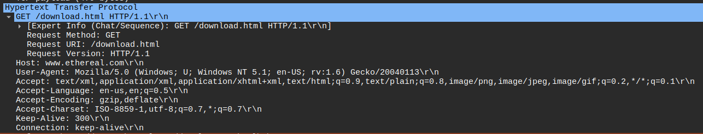
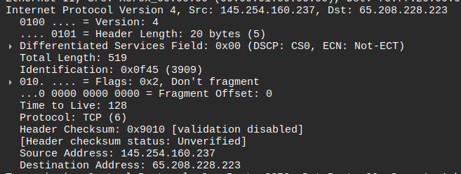
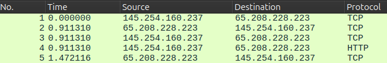
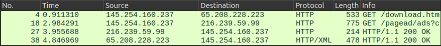
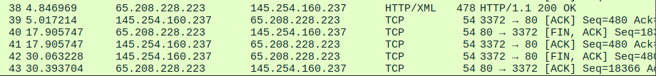

  <h2 style="text-align: center;font-weight: bold">LAPORAN PRAKTIKUM   WORKSHOP ADMINISTRASI JARINGAN </h2>
  <h4 style="text-align: center;">Dosen Pengampu : Dr. Ferry Astika Saputra, S.T., M.Sc.</h4>

 

  
  <h3 style="text-align: center;">Disusun Oleh : </h3>
  

    <strong>Danur Isa Prabutama (3123500023)</strong> 
  

<h3 style="text-align: center;line-height: 1.5">Politeknik Elektronika Negeri Surabaya Departemen Teknik Informatika Dan Komputer Program Studi Teknik Informatika 2025/2026</h3>
  

<h3 style="text-align: center;line-height: 1.5">Tugas Review</h3>

### 1. Analisa file http.cap dengan wireshark:

#### a. Versi HTTP

Dari gambar tersebut dapat diperoleh informasi bahwa versi HTTP yang digunakan 
	adalah versi 1.1

#### b. IP address client dan server

Dari gambar tersebut dapat diperoleh informasi IP Client dan IP Server yang dapat dilihat dari Source yaitu client dan Destination yaitu server dengan rincian sebagai berikut: 
IP Client: 145.254.160.237
IP Server: 65.208.228.223

#### c. Waktu dari client mengirimkan HTTP request

Pada gambar tersebut dapat diperoleh informasi mengenai waktu pengiriman HTTP Request yang dilakukan oleh client. Pada packet nomor 4 merupakan paket yang berisi HTTP Request karena pada kolom protocol berisi HTTP. Sehingga dari informasi tersebut dapat disimpulkan bahwa HTTP Request terjadi pada detik ke-0.911310

#### d. Waktu dari server mengirimkan response dan berapa durasinya

Dari gambar tersebut dapat diperoleh informasi bahwa HTTP response dikirim oleh server pada detik ke-4.846969 yang terletak pada frame nomor 38.

Untuk menentukan durasi pengiriman response dari server dibutuhkan  2 informasi yaitu waktu pengiriman HTTP Response yang sudah diketahui pada frame nomor 38 dan waktu server mengirim data terakhir yang ditandai dengan flag [FIN, ACK] yang berasal dari server yang terdapat pada ke-40.

Maka durasi pengiriman response adalah:

- Waktu pengiriman response pertama: 4.846969
- Waktu server mengirim paket terakhir: 17.905747
- Durasi pengiriman response = 17.905747 − 4.846969 =13.058778 detik

Sementara untuk menentukan durasi pengiriman response oleh server sampai dengan koneksi antara server dan client berakhir adalah:

- Waktu pengiriman response pertama: 4.846969
- Waktu koneksi berakhir: 30.393704
- Durasi total koneksi pengiriman response = 30.393704−4.846969 = 25.546735 detik

### 2. Deskripsi Gambar Slide 3

Saat kita menggunakan sebuah komputer dalam jaringan seperti ketika melakukan pencarian pada browser maka yang terjadi sebenarnya adalah komputer sedang melakukan komunikasi dengan komputer lain dalam jaringan komputer. Proses komunikasi komputer terjadi melalui berbagai lapisan jaringan, seperti yang ditunjukkan pada gambar di atas. Masing-masing lapisan tersebut memiliki perannya masing-masing jaringan komputer. Berikut penjelasan dari peran masing-masing lapisan:

- Data Link: Peran lapisan data link dalam jaringan adalah mengatur komunikasi langsung antara perangkat yang terhubung secara fisik. Pada layer ini data akan diubah menjadi frame yang bisa dikirim melalui media fisik. Layer ini juga mempunyai peran Physical Addressing yang menggunakan MAC Address untuk mengidentifikasi perangkat di jaringan lokal. Selain itu, layer ini juga mampu mendeteksi error yang terjadi saat proses pengiriman data.

- Network: Dalam komunikasi jaringan komputer layer network berperan mengatur Logical Addressing dengan menggunakan IP Address. Layer ini mampu menentukan rute terbaik agar data dapat dikirim ke perangkat di jaringan yang berbeda.

- Transport: Layer Transport mengatur komunikasi antar aplikasi di berbagai perangkat. Peran utama lapisan ini adalah memastikan data dikirim dengan aman dan membagi data menjadi bagian-bagian kecil atau yang disebut sebagai segmentation dan reassembly.

### 3. Rangkuman Tahapan Komunikasi Menggunakan TCP

TCP adalah protokol untuk mengirim data dan pesan melalui jaringan yang terjadi pada layer transport untuk menyediakan layanan yang andal dan mempunyai mekanisme yang canggih untuk mengetahui serta memastikan data sampai ditujuan dengan keadaan yang sama dengan ketika dikirim. Cara kerja protokol TCP adalah sebagai berikut:

#### a. Three-Way Handshake (Membangun Koneksi)

- SYN: Client mengirimkan paket SYN (synchronize) ke server untuk meminta memulai koneksi.
- SYN-ACK: Server merespon dengan paket SYN-ACK (synchronize-acknowledge) untuk mengonfirmasi permintaan.
- ACK: Klien mengirimkan paket ACK (acknowledge) sebagai balasan, dan koneksi pun terbentuk.

#### b. Data Transmission (Pengiriman Data)

Setelah koneksi terbentuk, data dikirim dalam bentuk segmen TCP.
Setiap segmen memiliki nomor urut (sequence number) dan penerima mengirimkan ACK untuk mengkonfirmasi penerimaan.
Jika segmen hilang atau rusak, pengirim akan mengirim ulang data.

#### c. Four-Way Handshake (Terminasi Koneksi)

- FIN: Klien mengirimkan paket FIN (finish) untuk mengakhiri koneksi.
- ACK: Server merespons dengan ACK, tetapi koneksi tetap terbuka sementara.
- FIN: Server juga mengirim FIN untuk mengakhiri koneksi dari sisi mereka.
- ACK: Klien merespons dengan ACK, dan koneksi ditutup sepenuhnya
