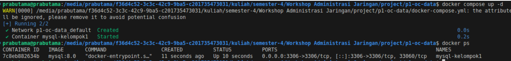
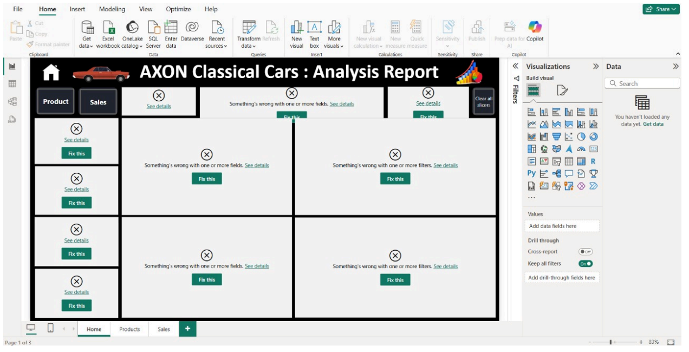
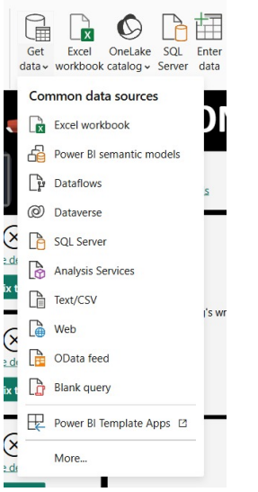
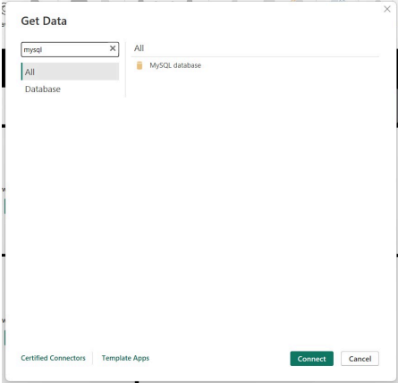
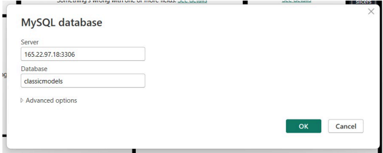
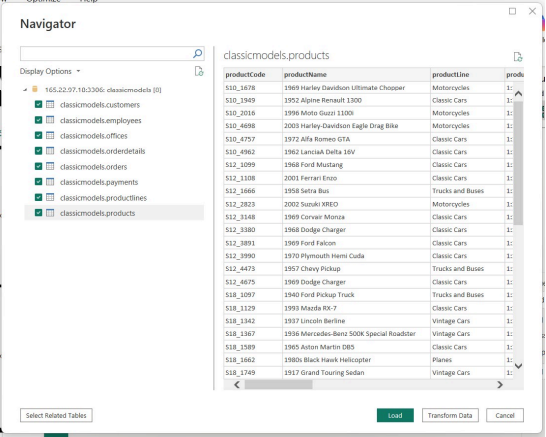
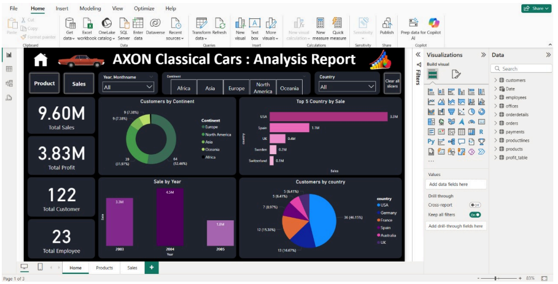

<div align="center">

# LAPORAN PRAKTIKUM
## WORKSHOP ADMINISTRASI JARINGAN

**Projek 1 - Business Intelligence dengan Docker & Power BI**


### **Informasi Praktikum**

**Dosen Pengampu**: Dr. Ferry Astika Saputra, S.T., M.Sc.  
**Mahasiswa**: Danur Isa Prabutama  
**NRP**: 3123500023  
**Kelas**: 2-D3 IT A  
**Kelompok**: 1  

### **Institusi**
**POLITEKNIK ELEKTRONIKA NEGERI SURABAYA**  
DEPARTEMEN TEKNIK INFORMATIKA DAN KOMPUTER  
PROGRAM STUDI TEKNIK INFORMATIKA  
**2025/2026**

---

</div>

## Daftar Isi

- [Tujuan Praktikum](#tujuan-praktikum)
- [Tools yang Digunakan](#tools-yang-digunakan)
- [Projek 1: Sistem Business Intelligence](#projek-1-sistem-business-intelligence)
  - [Pembuatan Container](#pembuatan-container)
  - [Menjalankan Container](#menjalankan-container)
  - [Visualisasi dengan Power BI](#visualisasi-dengan-power-bi)
- [Kesimpulan](#kesimpulan)

---

## Tujuan Praktikum

Praktikum ini bertujuan untuk:
- Memahami konsep containerization menggunakan Docker
- Membuat sistem Business Intelligence untuk analisis data
- Mengintegrasikan database MySQL dengan Power BI
- Membuat dashboard interaktif untuk visualisasi data penjualan

---

## Tools yang Digunakan

| Tool | Versi | Fungsi |
|------|-------|--------|
| **Docker** | Latest | Container platform |
| **MySQL** | 8.0 | Database server |
| **Power BI Desktop** | Latest | Data visualization |
| **Docker Compose** | Latest | Multi-container orchestration |

---

## Projek 1: Sistem Business Intelligence

### **Deskripsi Projek**

Merancang dan membangun sebuah sistem **Business Intelligence (BI)** untuk menganalisis data penjualan mobil. Sistem ini terdiri dari dua komponen utama:

**Arsitektur Sistem:**


#### **Komponen Sistem:**

1. **Database Server (Docker Container)**
   - Menyimpan dan mengelola data penjualan secara terstruktur
   - Menggunakan MySQL 8.0 dalam container Docker
   - Persistent storage untuk data integrity

2. **Power BI Desktop**
   - Alat visualisasi data untuk membuat laporan interaktif
   - Dashboard yang memberikan wawasan menyeluruh
   - Real-time connection ke database

---

### Pembuatan Container

#### **File `docker-compose.yml`**

File konfigurasi untuk mengatur dan menjalankan service database MySQL:

```yaml
version: '3.8'
services:
  mysql-kelompok1:
    image: mysql:8.0
    container_name: mysql-kelompok1
    restart: always
    environment:
      MYSQL_ROOT_PASSWORD: kelompok1
      MYSQL_USER: kelompok1
      MYSQL_PASSWORD: kelompok1
      MYSQL_DATABASE: classicmodels
    ports:
      - "3306:3306"
    volumes:
      - ./data:/var/lib/mysql
      - ./data.sql:/docker-entrypoint-initdb.d/data.sql
    command: --default-authentication-plugin=mysql_native_password
```

#### **Konfigurasi Dijelaskan:**

| Parameter | Fungsi |
|-----------|--------|
| `restart: always` | Container otomatis restart jika terjadi kegagalan |
| `environment` | Pengaturan kredensial MySQL (root, user, password: kelompok1) |
| `ports: 3306:3306` | Mapping port untuk akses eksternal |
| `volumes` | Persistent storage dan auto-initialization script |
| `--default-authentication-plugin` | Kompatibilitas dengan aplikasi klien |

#### **Fitur Utama:**
- **Auto-restart**: Container restart otomatis saat server reboot
- **Secure Authentication**: Password protection dengan mysql_native_password
- **Persistent Data**: Data tersimpan permanent di host storage
- **Auto-initialization**: Database dan data sample ter-load otomatis

---

### Menjalankan Container

#### 1. **Start Container**
```bash
docker compose up -d
```
> **Note**: Flag `-d` menjalankan container di background (daemon mode)



#### 2. **Verifikasi Status**
```bash
docker ps
```

#### 3. **Expected Output**
```bash
CONTAINER ID   IMAGE       COMMAND                  STATUS
abc123def456   mysql:8.0   "docker-entrypoint.s…"  Up 2 minutes
```

#### 4. **Container Logs (Optional)**
```bash
docker logs mysql-kelompok1
```

---

### Visualisasi dengan Power BI

#### **Langkah 1: Tampilan Awal Dashboard**



> **Keterangan**: Tampilan awal Power BI Desktop dengan canvas kosong, siap untuk konfigurasi data source.

---

#### **Langkah 2: Koneksi Data Source**

1. **Get Data**
   - Klik tombol **"Get Data"**
   - Pilih **"More..."** untuk opsi tambahan

   

2. **Pilih MySQL Database**
   - Cari **"MySQL database"**
   - Klik **"Connect"**

   

---

#### **Langkah 3: Konfigurasi Koneksi**

```yaml
Database Configuration:
  Server: 165.22.97.18:3306
  Database: classicmodels
  Username: kelompok1
  Password: kelompok1
```



---

#### **Langkah 4: Import Data Tables**

1. **Navigator Menu**
   - Setelah koneksi berhasil, akan muncul **Navigator**
   - Pilih **semua tabel** yang tersedia
   - Klik **"Load"** untuk import data

   

2. **Import Success**
   
   Setelah proses loading selesai, semua tabel berhasil diimpor ke Power BI Desktop.

---

#### **Langkah 5: Rename Tables**

**Sebelum visualisasi**, rename semua tabel dengan menghapus prefix `classicmodels`:

| Original Name | New Name |
|---------------|----------|
| `classicmodels.customers` | `customers` |
| `classicmodels.orders` | `orders` |
| `classicmodels.products` | `products` |
| `classicmodels.orderdetails` | `orderdetails` |

---

#### **Hasil Akhir: Dashboard Siap Digunakan**

Setelah semua langkah selesai, data berhasil **divisualisasikan** dan siap untuk pembuatan dashboard interaktif:



---

## Kesimpulan

1. **Container Management**
   - Berhasil membuat dan menjalankan MySQL container
   - Konfigurasi persistent storage dan auto-restart
   - Database initialization dengan sample data

2. **Data Integration**
   - Koneksi sukses antara MySQL dan Power BI
   - Import semua tabel database
   - Konfigurasi data source yang optimal

3. **Business Intelligence Setup**
   - Dashboard foundation telah siap
   - Data structure ter-organize dengan baik
   - Platform ready untuk analisis mendalam


