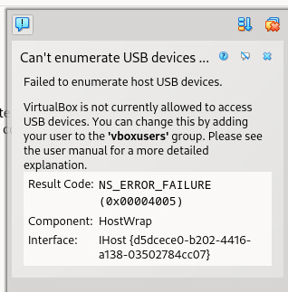
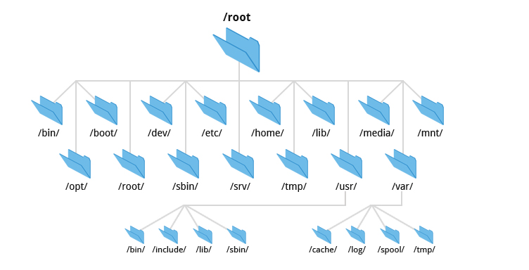

<div align="center">
  <h2 style="text-align: center;font-weight: bold">LAPORAN PRAKTIKUM <br/> WORKSHOP ADMINISTRASI JARINGAN</br></h2>
  <h4 style="text-align: center;">Dosen Pengampu : Dr. Ferry Astika Saputra, S.T., M.Sc.</h4>
</div>
<br />
<div align="center">
  
  <h3 style="text-align: center;">Disusun Oleh : </h3>
  <p style="text-align: center;">
    <strong>Danur Isa Prabutama (3123500023)</strong><br>
  </p>

<h3 style="text-align: center;line-height: 1.5">Politeknik Elektronika Negeri Surabaya<br>Departemen Teknik Informatika Dan Komputer<br>Program Studi Teknik Informatika<br>2025/2026</h3>
  <hr>
</div>

<h3 style="text-align: center;line-height: 1.5">Tugas Instalasi Debian & Modul 4,5,6</h3>

### Penyelesaian masalah <i>booting</i>

Kami mengalami kendala pada saat menyalakan PC yaitu gagal booting. Untuk langkah penyelesaiannya adalah sebagai berikut:

###### 1. Masuk ke peraturan BIOS pada PC dengan menekan F2 (menyesuaikan dengan PC yang digunakan).

###### 2. Pilih menu booting.

###### 3. Ubah UEFI menjadi Legacy.

###### 4. Setelah muncul opsi booting, ubah urutannya dan pastikan Hardisk berada di paling atas.

###### 5. Tekan F10 untuk keluar -> simpan perubahan

Setelah perubahan pertauran tersebut maka sistem berhasil booting dan masuk ke sistem operasi.

### Instalasi Virtualbox

Untuk melakkan percobaan pada modul 4,5 dan 6 dibutuhkan sebuah <i>virtual machine</i> untuk menjalankan Sistem Operasi Debian. Untuk melakukan instalasi Virtualbox terdapat pada langkahh-langkah berikut:

###### 1. Mengunjungi website VirtualBox https://www.virtualbox.org/wiki/Downloads


Pada saat link klik akan menampilkan bebrapa platform sistem operasi.

###### 2. Instal package yang telah di unduh


Setelah mendapatkan package dari website resmi virtualbox, lakukan instalasi package dengan menggunakan `dpkg -i`.

###### 3. Masalah dalam penggunaan virtualbox



Ketika proses insalasi sudah selesai dan mencoba menjalankan virtualbox maka akan muncul error seperti pada gambar diatas. Error tersebut berarti bahwa virtualbox tidak memiliki izin untuk mengakses perangkat USB.

###### 4. Penyelesaian masalah


Pada pesan <i>error</i> yang ada, dijelaskan bahwa kita dapat mengatasi masalah tersebut dengan menambahkan user ke vboxusers group. kita dapat melakukannya dengan perintah `sudo usermod -a -G vboxusers $USER`. Tutup virtualbox dan buka kembali. Jika error tetap muncul lakukan reboot.

### Instalasi Debian

###### 1. Unduh debian ISO dari https://www.debian.org.


Untuk persiapan instalasi unduh file ISO debian 12 dari website resmi debian dengan mengunjungi link tersebut.

###### 2. Konfigurasi awal.


Setelah menngunduh file ISO dari website debian, selanjutnya buka virtualbox dan klik menu New. Setelah diklik akan menampilkan konfigurasi dasar dari instalai virtual machine yang meliputi nama, lokasi instalasi, dan file ISO yang akan digunakan. Selain itu juga terdapat menu username and password, hardware, dan harddisk.

###### 2. Pemilihan software.


Saat proses instalasi dimulai, proses instalasi base system dan berlanjut ke pemilihan dan instalasi software.

###### 2. Pemilihan software.


Setelah proses insatalasi selesai, masuk ke sistem debian dengan menggunakan username dan password yang telah dikonfigurasi pada awal instalasi. Selanjutnya akan muncul pop up yang beris pengaturan bahasa dan lokasi. Jika sudah terdapat tampilan seperti pada gambar diatas berarti instalalsi sudah selesai dan vm debian siap digunakan. struktur data didalam kernel akan melacak status proses, prioritas, parameter penjadwalan dan sebagainya. Proses dapat dikatakan seperti wadah sumber daya yang dikelola oleh kernel.

### Modul 4: Process Control

##### Komponen Proses.

Sebuah proses terdiri dari sebuah ruang alamat dan kumpulan dari beberapa struktur data di dalam kernel. Ruang alamat adalah memori yang mempunyai tanda dari kernel yang bisa digunakan oleh proses. Memori biasanya berukuran 4KiB atau 8 KiB yang berada sebuah halaman. Halaman berfungsi menyimpan kode, data, dan tumpukan proses. sumber daya yang dikelola kernel meilput Halaman memori, deskriptor file, atribut proses.

Struktur data internal kernel menacatat berbagai informasi tentang setiap proses meliputi:

- Peta ruang alamat proses
- Status proses (berjalan, tridur, dan dll)
- Prioritas proses
- Penggunaan sumber daya (CPU, memori, dll)
- Informasi file dan port yang dibuka oleh proses
- Signnal mask (Sekumpulann sinyal yang saat ini sedang diblokir, artinya proses ini tidak akan menerima sinyal yang sedang diblokir)
- Pemilik proses

`Thread` adalah bagian dari eksekusi dari sebuah proses. Sebuah proses dapat memiliki beberapa thread yang masing-masing akan berbagi ruang alamat dan sumber daya. Thread digunakan untuk menerapkan paralelisme dalam proses.

##### Nomor Proses ID (PID)

Setiap proses yang ada didientifikasi dengan nomor PID yang unik. PID ini berguna untuk melakukan aksi kepada proses seperti pemanggilan sistem dalam mengirim sinyal. Beberapa proses memungkinkan untuk memiliki PID yang sama dengan konsep `namespaces`. namespaces akan menciptakan kontainer untuk menjalankan proese-proses didalamnya dengan pandangan tersendiri kepada sumber daya.

##### Nomor Proses ID Induk (PPID)

Setiap proses juga memiliki proses ID induk, yang artinya proses yang membuatnya. PPID digunakan untuk merujuk ke proses induk dalam berbagai panggilan sistem, misalnya, untuk mengirim sinyal ke proses induk.

##### ID pengguna dan ID pengguna Efektif (UID and EUID)

ID pengguna adalah ID dari pemilik proses. Dalam pengalokasian sumber daya oleh kernel, proses menentukan melalui ID pengguna efektif. Dengan begitu kernel dapat menentukan sumnber daya mana yang bisa diakses oleh proses

##### Siklus Proses

Siklus proses memiliki 4 tahapan sebagai berikut:

1. Dibuat (Created)
   Proses dibuat dengan menggunakan `fork` dari proses yang sudah ada sehingga menghasilkan proses baru, namun sebenarnya linux menggunakan mekanisme clone untuk menjaga kompatibilitas dengan sistem lama.

2. Berjalan (Running)
   Proses sudah mendapatkam sumber daya dan dieksekusi oleh CPU. proses memungkinkan untuk berubah menjadi ready (menunggu giliran untuk dieksekusi)

3. Menunggu (Waiting)
   Proses menunggu suatu event atau sumber daya, seperti input pengguna, data dari disk, atau sinyal dari proses lain.

4. Berhenti (Terminated):
   Proses selesai dieksekusi atau dihentikan secara paksa (misalnya, karena error atau perintah pengguna).

##### Sinyal

Sinyal adalah instruksi yang dikirimkan kepada proses untuk memberi tahu kejadian tertentu. Berikut contoh penggunaan sinyal:

1. Dapat dikirim diantara proses sebagai sarana komunikasi
2. Dapat dikirim dari terminal untuk melakukan aksi
3. Dapat dikirim oleh Administrator
4. Dapat dikirim kernel ketika suatu proses melakukan pelanggaran
5. Dapat dikirm kernel untuk memberitahukan sebuah kondisi yang menarik.


Sinyal KILL, INT, TERM, HUP, dan QUIT sekilas seperti sinyal yang sama, tetapi dapat dibedakan dari penggunaannya.

- KILL tidak dapat diblokir dan menghentikan proses pada tingkat kernel. Sebuah proses tidak akan pernah benar-benar menerima atau menangani sinyal ini.

- INT dikirim oleh driver terminal ketika user mengetikan sesuatu. Contoh pengiriman sinyal ini adalah pada program sederhana yang dihentikan dengan `Ctrl + C`

- TERM adalah permintaan untuk menghentikan eksekusi sepenuhnya. Diharapkan proses yang menerima akan membersihkan statusnya dan keluar.

- HUP awalnya terkait dengan menutup koneksi telepon, tetapi sekarang digunakan untuk memberi tahu proses bahwa terminal pengendali telah ditutup atau untuk meminta proses daemon memulai ulang.

- QUIT mirip dengan TERM, kecuali bahwa ia secara default menghasilkan core dump jika tidak tertangkap. Beberapa program mengkanibalisasi sinyal ini dan menafsirkannya sebagai sesuatu yang lain.

##### Kill: Pengiriman Sinyal

Penggunaan paling umum dari perintah `kill` adalah untuk menghentikan suatu proses.`kill` dapat digunakan tanpa nomor sinyal tai tidak menjamin bahwa proses akan mati, tetapi menggunakan `kill -9 [pid]` menjamin proses akan benar-benar mati. Sinyal `killall` digunakan berdasarkan nama bukan ID, tapi ini tidak tersedia disemua sistem

##### PS: Monitoring Proses

`ps` adalah perintah yang digunakan untuk menampilkan semua proses. Meskipun tersedia beberapa argumen, `ps` tetap menampilkan informasi yang pada dasarnya sama. `ps` dapat menampilkan PID, UID, prioritas, dan terminal kontrol proses. Ia juga menginformasikan kepada Anda berapa banyak memori yang digunakan sebuah proses, berapa banyak waktu CPU yang digunakan, dan apa statusnya saat ini (berjalan, berhenti, tidur, dan seterusnya).


Satu set argumen lain yang berguna adalah lax, yang memberikan lebih banyak informasi teknis tentang proses. lax sedikit lebih cepat daripada aux karena tidak perlu menyelesaikan nama pengguna dan grup.


Untuk mencari proses tertentu, Anda bisa menggunakan grep untuk memfilter output ps `$ ps aux | grep -v grep | grep firefox`. Kita dapat `pgrep` atau `pidof`

##### Pemantauan interaktif dengan Top

Perintah top menyediakan tampilan real-time yang dinamis dari sistem yang sedang berjalan. Perintah ini dapat menampilkan informasi ringkasan sistem serta daftar proses atau thread yang saat ini dikelola oleh kernel Linux. Jenis informasi ringkasan sistem yang ditampilkan serta jenis, urutan, dan ukuran informasi yang ditampilkan untuk proses, semuanya dapat dikonfigurasi oleh pengguna dan konfigurasi tersebut dapat dipertahankan selama proses restart.

Secara default, tampilan diperbarui setiap 1-2 detik, tergantung pada sistem. Ada juga perintah htop, yang merupakan penampil proses interaktif untuk sistem Unix. Ini adalah aplikasi mode teks (untuk konsol atau terminal X) dan membutuhkan ncurses.

##### Nice dan renice: mengubah prioritas proses

Nilai niceness adalah petunjuk numerik ke kernel tentang bagaimana proses harus diperlakukan dalam kaitannya dengan proses lain yang bersaing untuk CPU. Prioritas dalam proses didahulukan dari nomor niceness yang rendah. Perintah nice digunakan untuk memulai proses dengan nilai niceness tertentu. Sintaksisnya adalah.Perintah nice digunakan untuk memulai proses dengan nilai niceness tertentu. Sintaksisnya adalah.

Contoh penggunaan `nice` dan `renice`


Nilai prioritas adalah prioritas aktual proses yang digunakan oleh kernel Linux untuk menjadwalkan tugas. Dalam sistem Linux, prioritasnya adalah 0 hingga 139, yaitu 0 hingga 99 untuk waktu nyata dan 100 hingga 139 untuk pengguna.

Hubungan antara nilai bagus dan prioritas adalah sebagai berikut:

priority_value = 20 + nice_value

##### The /proc filesystem

`/proc` adalah direktori yang menyimpan setiap proses yang ada di komputer. Struktur dari direktori `/proc` adalah `/proc/[PID]/[informasi proses]`

##### Strace and truss

`strace` dan `truss` adalah alat yang digunakan untuk melacak system calls dan signal dari suatu proses. Mekanisme ini digunakan jika suatu program berjalan sesuai dengan yang diharapkan.


##### Proses tidak terkendali

Proses yang tidak terkendali
Kadang-kadang suatu proses akan berhenti merespons sistem dan menjadi liar. Proses-proses ini mengabaikan prioritas penjadwalannya dan bersikeras menggunakan 100% CPU. Karena proses lain hanya dapat memperoleh akses terbatas ke CPU, mesin mulai berjalan sangat lambat. Ini disebut proses yang tidak terkendali. Proses ini dapat dihentikan dengan mengguanakan `kill -9 [PID]`

##### Penjadwalan kerja

`cron` adalah alat yang digunakan untuk melakukan penjadwalan kerja pada sistem. `cron` akan membaca konfigurasi yang disebut crontab di direktoi `/var/spool/cron`.

###### Format crontab

```bash
*     *     *     *     *  command to be executed
-     -     -     -     -
|     |     |     |     |
|     |     |     |     +----- day of week (0 - 6) (Sunday=0)
|     |     |     +------- month (1 - 12)
|     |     +--------- day of month (1 - 31)
|     +----------- hour (0 - 23)
+------------- min (0 - 59)
```

Contoh konfigurasi crontab

```bash
# Run a command at 2:30am every day
30 2 * * * command

# Run a command at 10:30pm on the 1st of every month
30 22 1 * * command

# Run a Python script every 1st of the month at 2:30am
30 2 1 * * /usr/bin/python3 /path/to/script.py
```

Perintah crontab digunakan untuk membuat, mengubah, dan menghapus crontab. Opsi -e digunakan untuk mengedit berkas crontab, opsi -l digunakan untuk mencantumkan berkas crontab, dan opsi -r digunakan untuk menghapus berkas crontab.

##### Systemd timer

Systemd timer adalah alternatif dari cron dimana memiliki kelebihan dalam fleksibilitas. Layanan ini dapat di picu melalui unit timer atau peristiwa terentu.


anacron.timer


Opsi OnCalendar digunakan untuk menentukan kapan timer harus mengaktifkan layanan. Opsi AccuracySec digunakan untuk menentukan keakuratan timer. Opsi Persistent digunakan untuk menentukan apakah timer harus mengejar run yang terlewat.

##### Penggunaan umum penjadwalan

###### Pengiriman email

    30 4 25 * * /usr/bin/mail -s "Monthly report"
    abdou@admin.com%Receive the monthly report for the month of July!%%Sincerely,%cron%

###### Memberishkan file system

    0 0 * * * /usr/bin/find /home/abdou/.local/share/Trash/files -mtime +30 -exec /bin/rm -f {} \;

###### Memutar berkas log

Memutar berkas log berarti membaginya menjadi beberapa segmen berdasarkan ukuran atau tanggal, dengan tetap menyediakan beberapa versi lama dari log tersebut setiap saat. Karena rotasi log merupakan peristiwa yang berulang dan terjadi secara teratur, maka tugas ini sebaiknya dijadwalkan.

###### Menjalankan pekerjaan batch

Beberapa kalkulasi yang berjalan lama sebaiknya dijalankan sebagai pekerjaan batch. Misalnya, pesan dapat terkumpul dalam antrean atau basis data. Anda dapat menggunakan pekerjaan cron untuk memproses semua pesan yang diantrekan sekaligus sebagai ETL (Ekstrak, Transformasi, Muat) ke lokasi lain, seperti gudang data.

###### Mencadangkan dan membuat mirroring

Anda dapat menggunakan tugas terjadwal untuk membuat backup direktori secara otomatis ke sistem jarak jauh. Mirror adalah salinan byte per byte dari sistem berkas atau direktori yang dihosting di sistem lain. Mirror dapat digunakan sebagai bentuk cadangan atau sebagai cara untuk mendistribusikan berkas ke beberapa sistem. Anda dapat menggunakan eksekusi rsync secara berkala untuk menjaga mirror tetap mutakhir.

### Modul 5: The filesystem



Tujuan utama sistem berkas (filesystem) adalah mengatur dan mengelola penyimpanan data. Sistem berkas terdiri dari empat bagian utama:

- Namespace - Cara memberi nama dan mengatur data dalam struktur hierarki (seperti folder dan file).

- API - Perintah untuk mengakses, mengelola, dan memanipulasi data.

- Model Keamanan - Skema untuk melindungi, menyembunyikan, atau berbagi data.

- Implementasi - Perangkat lunak yang menghubungkan sistem berkas dengan perangkat keras.

Beberapa sistem berkas populer adalah ext4, XFS, ZFS, dan Btrfs. Ada juga sistem berkas dari Windows seperti FAT dan NTFS, serta ISO 9660 untuk CD/DVD.

Sistem berkas modern bertujuan meningkatkan kecepatan, keandalan, atau menambahkan fitur baru di atas fungsi dasar sistem berkas.

##### Pathnames

"Folder" adalah istilah umum di Windows dan macOS, tapi dalam konteks teknis lebih sering disebut direktori. Pathname adalah alamat file dalam sistem berkas, bisa berupa:

- Absolute: Jalur lengkap, contoh: /home/username/file.txt.
- Relative: Jalur dari lokasi saat ini, contoh: ./file.txt.

##### Filesystem Mounting and Unmounting

Sistem berkas terdiri dari bagian-bagian kecil (filesystem), yang masing-masing berisi direktori dan file-file di dalamnya. File tree adalah struktur keseluruhan, sedangkan filesystem adalah cabang-cabangnya. Untuk menghubungkan filesystem ke file tree, gunakan perintah mount. Contoh:

    mount /dev/sda4 /users

Untuk melepas filesystem:

`umount -l`: Lazy unmount (melepas secara perlahan saat tidak digunakan).

`umount -f`: Force unmount (melepas paksa saat filesystem sibuk).

Sebelum menggunakan umount -f, cek proses yang sedang menggunakan filesystem dengan lsof atau fuser, lalu hentikan proses tersebut.


Untuk menyelidiki proses yang menggunakan sistem berkas dapat menggunakan perintah ps.


##### Organization of the file tree

Sistem UNIX tidak pernah benar-benar terorganisir dengan rapi! Berbagai konvensi penamaan yang tidak kompatibel digunakan secara bersamaan, dan berbagai jenis file tersebar secara acak di dalam namespace. Inilah mengapa sulit untuk melakukan upgrade sistem operasi.

###### Root Filesystem (Filesystem Root)

- Root filesystem setidaknya berisi direktori root (/) dan sekumpulan file serta subdirektori minimal.

- File yang berisi kernel sistem operasi biasanya berada di /boot, tetapi nama dan lokasi pastinya bisa bervariasi.

- Di sistem BSD dan beberapa UNIX lainnya, kernel bukanlah satu file tunggal, melainkan sekumpulan komponen.

###### Direktori Penting

- `/etc`: Berisi file konfigurasi dan sistem seperti file konfigurasi jaringan, pengguna, dan layanan.

- `/sbin dan /bin`: Berisi utilitas penting yang diperlukan untuk booting dan perbaikan sistem.

- `/sbin`: biasanya untuk perintah administratif, sedangkan /bin untuk perintah dasar.

- `/tmp`: Digunakan untuk menyimpan file sementara.

- `/dev`: Pada awalnya bagian dari root filesystem, tetapi sekarang diguankan sebagai virtual filesystem yang di-mount terpisah. Berisi file perangkat (device files) yang mewakili hardware.

- `/lib atau /lib64`: Berisi file library (pustaka) yang dibutuhkan oleh program sistem. Beberapa sistem memindahkan ini ke /usr/lib dan membuat /lib sebagai symbolic link.

- `/usr`: Berisi program standar yang tidak kritis untuk sistem, manual (panduan), dan library. Di FreeBSD, banyak konfigurasi lokal disimpan di /usr/local.

- `/var`: Berisi file yang sering berubah atau tumbuh, seperti: Direktori spool (misalnya, untuk email atau printer). File log (catatan sistem). Informasi akuntansi.

- `/var`: harus tersedia agar sistem bisa boot ke mode multiuser.


##### File types

Sebagian besar implementasi sistem berkas (filesystem) mendefinisikan 7 jenis file:

- File biasa (data atau program).
- Direktori (folder).
- File perangkat karakter (seperti keyboard).
- File perangkat blok (seperti hard disk).
- Socket (untuk komunikasi antar proses).
- Pipa bernama (untuk mengirim data antar program).
- Tautan simbolis (shortcut ke file lain).

Gunakan perintah `file` untuk mengecek jenis file.

Anda juga dapat menggunakan `ls -ld`, tanda `-d` memaksa `ls` untuk menampilkan informasi suatu direktori daripada menampilkan isi direktori.


File biasa adalah file yang berisi data (seperti teks, program, atau library) tanpa struktur khusus.

Direktori adalah `folder` yang berisi daftar file atau direktori lain.

Hard link adalah cara membuat banyak nama untuk satu file yang sama. Misalnya, file `A` bisa diakses melalui nama `A` atau `B `jika dibuat hard link-nya.

Gunakan perintah `ln` untuk membuat hard link.

Gunakan `ls -i` untuk melihat jumlah hard link yang merujuk ke suatu file.

Contoh penggunaan `ln`

Membuat hard link untuk file /etc/passwd agar dapat diakses melalui /tmp/passwd

Mengeluarkan isi dari /etc/passwd


Mengeluarkan isi dari /tmp/passwd


##### Character and block device files

- File perangkat
  Digunakan untuk berkomunikasi dengan hardware dan dikelola oleh driver di kernel. Memiliki nomor major (driver) dan minor (unit fisik).

- Direktori /dev
  Sekarang dikelola otomatis oleh kernel, bukan manual seperti dulu.

- Local domain socket
  Untuk komunikasi antar proses dalam satu mesin.

- Named pipe
  Mirip socket, tetapi lebih sederhana.

- Symbolic link
  Tautan fleksibel yang bisa menunjuk ke file atau direktori, bahkan di filesystem berbeda.

  contoh membuat symbolic link

      $ ln -s /bin /usr/bin

      $ ls -l /usr/bin
      lrwxrwxrwx 1 root root 4 Mar  1  2020 /usr/bin -> /bin

##### File attributes (Atribut file)

- Setiap file memiliki izin (permission) yang menentukan siapa yang bisa membaca `(r)`, menulis `(w)`, atau menjalankan `(x)` file.

- Ada 3 bit tambahan (seperti setuid, setgid, dan sticky bit) yang memengaruhi cara file atau direktori berperilaku.

- 4 bit tipe file menentukan jenis file (seperti file biasa atau direktori) dan tidak bisa diubah.

- Pemilik file atau root bisa mengubah izin file menggunakan perintah chmod.


##### Permission Bits (Bit Izin)

Bit izin di Unix dan Linux dibagi menjadi tiga kelompok, masing-masing terdiri dari 3 bit. Setiap kelompok menentukan izin untuk:

1. Pemilik (owner) -> U: user.

2. Grup (group) -> g: group.

3. Pengguna lain (others) -> o: others.

###### Notasi Oktal (Base 8):

- Setiap digit dalam notasi oktal mewakili 3 bit.

- 3 bit pertama (nilai oktal 400, 200, 100): Izin untuk pemilik.

- 3 bit tengah (nilai oktal 40, 20, 10): Izin untuk grup.

- 3 bit terakhir (nilai oktal 4, 2, 1): Izin untuk pengguna lain.

###### Arti Bit Izin:

- Read (r): Pada file memungkinkan untuk file dibaca dan pada direktori memungkin untuk isi direktori dibaca.

- Write (w): Pada file memungkinkan file diubah atau dipotong (truncated) dan pada direktori memungkinkan file di dalam direktori dihapus, diganti nama, atau dibuat baru.

  - Catatan: Kemampuan menghapus atau mengganti nama file sebenarnya dikontrol oleh izin direktori induk.

- Execute (x): Pada file memungkinkan file dijalankan dan pada direktori memungkinkan akses ke file di dalam direktori (seperti cd).

Di sistem Unix/Linux, file yang dapat dijalankan (executable) terbagi menjadi dua jenis: file biner yang dijalankan langsung oleh CPU, dan file skrip yang membutuhkan interpreter seperti shell atau Python. Jika file skrip tidak menentukan interpreter dengan baris shebang (#!), sistem akan menganggapnya sebagai skrip shell (sh). Kernel memahami sintaks #! dan akan menjalankan file dengan interpreter yang ditentukan. Namun, jika interpreter tidak ditentukan dengan benar, kernel akan menolak menjalankan file, dan shell akan mencoba menjalankannya sebagai skrip shell.

Untuk direktori, izin memiliki arti khusus. Bit execute (x), sering disebut search bit, memungkinkan pengguna masuk ke direktori atau mengakses file di dalamnya jika tahu namanya, tetapi tidak bisa melihat daftar isinya. Bit read (r) memungkinkan pengguna melihat daftar isi direktori, sementara bit write (w) memungkinkan pembuatan, penghapusan, atau penggantian nama file di dalam direktori. Kombinasi izin ini menentukan apa yang bisa dilakukan pengguna. Misalnya, izin r-x memungkinkan pengguna melihat daftar isi dan mengakses file, sedangkan izin -wx memungkinkan pembuatan atau penghapusan file tanpa bisa melihat daftar isinya. Dengan memahami kombinasi ini, pengguna dapat mengontrol akses ke file dan direktori dengan lebih efektif.

##### The setuid and setgid bits

Bit dengan nilai oktal 4000 dan 2000 adalah setuid dan setgid. Ketika bit setuid diaktifkan pada sebuah file, pemilik file akan sementara berubah menjadi pemilik file tersebut saat file dijalankan. Sedangkan, jika bit setgid diaktifkan pada file, grup file akan sementara berubah menjadi grup file tersebut saat file dijalankan.

Jika bit setgid diaktifkan pada sebuah direktori, file-file yang baru dibuat di dalam direktori tersebut akan memiliki kepemilikan grup yang sama dengan direktori, bukan grup default dari pengguna yang membuat file. Ini memudahkan berbagi file di antara sekelompok pengguna.

##### The sticky bit

Bit dengan nilai oktal 1000 disebut sticky bit. Ketika diaktifkan pada sebuah direktori, sticky bit mencegah pengguna menghapus atau mengganti nama file yang bukan milik mereka. Ini berguna untuk direktori seperti /tmp yang digunakan bersama oleh banyak pengguna, sehingga file-file di dalamnya tetap aman dari perubahan yang tidak diinginkan.

##### ls: list and inspect files

`ls -l` menampilkan detail file, termasuk izin, pemilik, ukuran, dan waktu modifikasi. Direktori selalu memiliki minimal dua hard link: satu untuk dirinya sendiri (.) dan satu untuk direktori induknya (..). File perangkat ditandai dengan huruf c (untuk character device) atau b (untuk block device), diikuti oleh nomor major dan minor yang mengidentifikasi perangkat.

##### chmod: change permissions

Perintah chmod digunakan untuk mengubah izin (mode) file atau direktori. Ada dua cara untuk menggunakannya:

- Notasi Oktal: Menggunakan angka (misalnya, 755).

- Notasi Simbolik: Menggunakan huruf dan simbol (misalnya, u+w).


| Contoh     | Penjelasan                                                                                               |
| ---------- | -------------------------------------------------------------------------------------------------------- |
| u+w        | Tambah izin tulis (write) untuk pemilik file. owner                                                      |
| ug=rw,o=r  | Beri izin baca/tulis (read/write) untuk pemilik dan grup, serta baca (read) untuk pengguna lain.         |
| a-x        | Hapus izin jalankan (execute) untuk semua pengguna.                                                      |
| ug=srx, o= | Setel bit setuid, setgid, dan sticky untuk pemilik dan grup, serta hapus semua izin untuk pengguna lain. |
| g=u        | Buat izin grup sama dengan izin pemilik.                                                                 |

##### chown: change ownership

- chmod --reference: Salin izin dari satu file ke file lain.
- chown: Ubah pemilik dan grup file/direktori.
- Gunakan -R untuk mengubah kepemilikan secara rekursif (semua file dan folder di dalamnya).

##### chgrp: change group

- chgrp: Ubah grup file/direktori.
- -R: Ubah grup secara rekursif (termasuk semua file dan folder di dalamnya).

##### umask: set default permissions

Perintah umask digunakan untuk mengatur izin default yang akan diberikan kepada file atau direktori baru. umask bekerja seperti mask bit yang mengurangi izin default untuk menentukan izin sebenarnya.

| Octal | Binary | Perms | Octal | Binary | Perms |
| ----- | ------ | ----- | ----- | ------ | ----- |
| 0     | 000    | rwx   | 4     | 100    | -wx   |
| 1     | 001    | rw-   | 5     | 101    | -w-   |
| 2     | 010    | r-x   | 6     | 110    | --x   |
| 3     | 011    | r--   | 7     | 111    | ---   |

- umask: Atur izin default untuk file/direktori baru.
- Angka umask mengurangi izin default:
- Contoh: umask 022 membuat file baru dengan izin 644 dan direktori baru dengan izin 755.
- Gunakan tabel di atas untuk memahami kombinasi izin

##### Access Control Lists

- ACL memperluas izin tradisional Unix, memungkinkan: Banyak pemilik untuk satu file, Izin berbeda untuk grup atau pengguna tertentu.

- Gunakan getfacl untuk melihat ACL dan setfacl untuk mengaturnya.

- Contoh: setfacl -m u:abdou:rw /etc/passwd memberi izin baca/tulis untuk pengguna abdou.

##### Implementation of ACLs

- ACL bisa dikelola oleh:

1.  Kernel: Untuk semua filesystem.
2.  Filesystem: Setiap filesystem menangani ACL sendiri.
3.  Protokol Jaringan: Seperti NFS atau SMB untuk file yang diakses melalui jaringan.

- Ini memungkinkan fleksibilitas dalam mengelola izin file, tergantung pada kebutuhan sistem.

##### POSIX ACLs

POSIX ACLs adalah jenis ACL (Access Control Lists) tradisional yang digunakan di sistem operasi mirip Unix, seperti Linux, FreeBSD, dan Solaris. ACL ini memungkinkan Anda memberikan izin lebih fleksibel daripada izin tradisional Unix.

| Format                | Example         | Sets permissions for                                  |
| --------------------- | --------------- | ----------------------------------------------------- |
| user::perms           | user:rw-        | Izin untuk pemilik file.                              |
| user:username:perms   | user:abdou:rw-  | Izin untuk pengguna tertentu (misalnya, abdou).       |
| group::perms          | group:r-x       | Izin untuk grup file.                                 |
| group:groupname:perms | group:users:r-x | Izin untuk grup tertentu (misalnya, users).           |
| mask::perms           | mask::rwx       | Batas maksimal izin untuk grup dan pengguna tertentu. |
| other::perms          | other::r--      | Izin untuk pengguna lain (selain pemilik dan grup).   |
|                       |

##### NFSv4 ACLs

NFSv4 ACLs adalah jenis ACL (Access Control Lists) yang lebih baru dan lebih canggih dibandingkan POSIX ACLs. ACL ini didukung oleh beberapa sistem operasi mirip Unix, seperti Linux dan FreeBSD. Fitur unggulannya adalah default ACL, yang memudahkan pengaturan izin untuk file/direktori baru.

### Modul 6: Software Installation and Management

##### Operating System Installation

Distribusi Linux dan FreeBSD memiliki prosedur instalasi dasar yang mudah. Untuk komputer fisik, Anda bisa melakukan booting dari CD, DVD, atau USB. Untuk mesin virtual, Anda bisa melakukan booting dari file ISO. Menginstal sistem operasi dasar dari media lokal cukup sederhana berkat aplikasi berbasis GUI yang memandu Anda melalui prosesnya.

##### Installation from the network

Menginstal OS pada banyak komputer menggunakan media lokal (USB/DVD) tidak efisien karena memakan waktu, rentan error, dan repetitif. Solusinya adalah instalasi melalui server jaringan, umum di data center dan cloud.

Metode umumnya menggunakan DHCP dan TFTP untuk booting tanpa media fisik, lalu mengambil file instalasi OS dari server via HTTP, FTP, atau NFS. Untuk instalasi otomatis, bisa menggunakan PXE (Preboot eXecution Environment), standar Intel yang memungkinkan booting melalui jaringan.

PXE seperti OS mini di ROM kartu jaringan, menyediakan API standar untuk BIOS, sehingga satu boot loader bisa netboot di PC mana pun yang mendukung PXE, tanpa perlu driver khusus untuk setiap kartu jaringan.


##### Linux Package Management Systems

Ada dua format paket yang umum digunakan di sistem Linux:

- RPM: Digunakan oleh Red Hat, CentOS, SUSE, Amazon Linux, dan distribusi sejenis.

- .deb: Digunakan oleh Debian dan Ubuntu.

Kedua format ini secara fungsional mirip dan berfungsi sebagai alat manajemen konfigurasi yang lengkap.

- RPM: Perintah `rpm` untuk instalasi, penghapusan, dan pencarian paket.

- .deb: Perintah yang digunakan untuk instalasi, penghapusan, dan pencarian paket adalah `dpkg`

- YUM (Yellowdog Updater, Modified): Digunakan untuk RPM, bisa mencari, mengunduh, dan mengelola dependensi paket.

- APT (Advanced Package Tool): Awalnya untuk .deb, tapi sekarang juga mendukung RPM, berfungsi untuk mengelola paket dan pembaruan sistem.

Kedua sistem ini memudahkan pengelolaan paket dan dependensi secara otomatis.

##### High-Level Package Management

Alat manajemen paket tingkat tinggi adalah yang paling sering digunakan untuk:

- Menginstal, menghapus, dan memperbarui paket.

- Mencari paket yang tersedia.

- Melihat daftar paket yang sudah terinstal di sistem.

Contoh alat ini termasuk YUM (untuk RPM) dan APT (untuk .deb). Mereka memudahkan pengelolaan paket dan dependensi secara otomatis.

##### Package repositories

Distributor Linux menyediakan repositori perangkat lunak yang terintegrasi dengan sistem manajemen paket mereka. Secara default, sistem manajemen paket biasanya terhubung ke server web atau FTP yang dikelola oleh distributor.

- Release: Versi lengkap dan konsisten dari kumpulan paket perangkat lunak.

- Component: Subset atau bagian tertentu dari perangkat lunak dalam sebuah release.

- Architecture: Kelas hardware yang mendukung sistem. Misalnya, arsitektur i386 pada release Fedora 20, yang berarti paket tersebut dirancang untuk hardware dengan arsitektur i386.

Arsitektur menentukan jenis hardware yang kompatibel dengan paket tertentu, sehingga sistem yang serupa dapat menjalankan biner yang sama.

##### APT: Advanced Package Tool

APT adalah sekumpulan alat untuk mengelola paket Debian dan sistem berbasis Debian seperti Ubuntu. Ini adalah sistem manajemen paket paling populer untuk distribusi tersebut. APT terdiri dari beberapa alat yang bekerja bersama, di antaranya:

- apt-get: Alat baris perintah untuk menginstal, menghapus, dan memperbarui paket.

- apt-cache: Alat untuk mencari dan menanyakan informasi paket dalam cache APT.

- apt-file: Alat untuk mencari file di dalam paket.

- apt-show-versions: Alat untuk menampilkan versi paket yang terinstal.

- aptitude: Antarmuka tingkat tinggi untuk manajemen paket, dengan lebih banyak fitur daripada apt-get.

- apt-mirror: Alat untuk membuat mirror (salinan) dari repositori paket.

##### yum: Yellowdog Updater, Modified

Yum adalah alat manajemen paket untuk sistem Linux berbasis RPM (seperti Red Hat, CentOS). Ini adalah alat tingkat tinggi yang menangani instalasi, pembaruan, dan penghapusan paket, termasuk menyelesaikan dependensi. Yum dapat mengelola paket dari repositori yang terinstal dan melakukan operasi melalui baris perintah pada paket individu.

##### Lokalisasi dan Konfigurasi Perangkat Lunak:

- Menyesuaikan sistem ke lingkungan lokal atau cloud adalah tugas penting dalam administrasi sistem.
- Menangani masalah lokalisasi secara terstruktur dan dapat direproduksi membantu mencegah pembuatan sistem yang unik ("snowflake systems") yang sulit dipulihkan setelah insiden besar.
