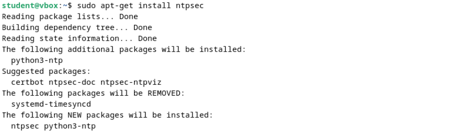

  <h2 style="text-align: center;font-weight: bold">LAPORAN PRAKTIKUM   WORKSHOP ADMINISTRASI JARINGAN </h2>
  <h4 style="text-align: center;">Dosen Pengampu : Dr. Ferry Astika Saputra, S.T., M.Sc.</h4>

 

  
  <h3 style="text-align: center;">Disusun Oleh : </h3>
  

    <strong>Danur Isa Prabutama (3123500023)</strong> 
  
-

<h3 style="text-align: center;line-height: 1.5">Politeknik Elektronika Negeri Surabaya Departemen Teknik Informatika Dan Komputer Program Studi Teknik Informatika 2025/2026</h3>
  

<h3 style="text-align: center;line-height: 1.5">Praktikum Minggu ke-3
</h3>

### Konfigurasi Network Time Protocol (NTP)

NTP Client (Network Time Protocol Client) adalah perangkat atau perangkat lunak yang berfungsi untuk sinkronisasi waktu sistem dengan server waktu menggunakan protokol NTP. NTP sendiri adalah protokol jaringan yang digunakan untuk menyinkronkan jam komputer melalui jaringan dengan tingkat akurasi yang tinggi, biasanya dalam hitungan milidetik.

#### Timesyncd

Debian 12 mempunyai ntp client default yang sudah terinstall yaitu timesync. Systemd-timesyncd adalah layanan sinkronisasi waktu sederhana yang terintegrasi dengan systemd. Berikut langkah konfigurasinya:

1. Cek status timesyncd

   

   Pada bagian status masih menggunakan NTP Server dari debian

2. Sesuiakan NTP server dengan NTP Server Indonesia yaitu: id.pool.ntp.org

   

3. Restart layanan timesyncd dengan perintah `sudo systemctl restart systemd-timesyncd`

4. Cek status timesyncd kembali

   

   Setelah restart layanan maka dibagian status sudah menggunakan NTP Server Indonesia.

#### NTPSec

NTP Secure (NTPsec), yaitu versi NTP yang telah ditingkatkan keamanannya. NTPsec adalah versi NTP yang dirancang untuk mengatasi kerentanan keamanan dan meningkatkan stabilitas. Berikut langkah konfigurasinya

1. Lakukan instalasi package NTPSec

   

2. Sesuaikan konfigurasi pool dengan NTP Server indonesia

   

3. Periksa sinkronisasi

   

#### Instalasi dan Konfigurasi Samba

Samba adalah perangkat lunak open-source yang memungkinkan berbagi file dan printer antara sistem operasi Windows dan Unix-like (seperti Linux, macOS, dan lainnya). Samba mengimplementasikan protokol SMB/CIFS (Server Message Block/Common Internet File System), yang merupakan protokol berbagi file dan printer yang digunakan secara luas di jaringan Windows. Berikut langkah konfigurasinya.

#### Instalasi package Samba

 

#### Percobaan fully access

1. Konfigurasi pada samba

   

2. Membuat sebuah file di direktori /home/share

   

3. Percobaan akses dari Host

   

4. Percobaan akses di komputer lain

   

#### Percobaan Limited Access

1. Konfigurasi pada samba

   

2. Membuat sebuah file untuk dibagikan di direktori /home/share01

   

3. Menambahkan user baru

  

4. Menambahkan user baru ke grup isagroup

  

5. Menambahkan user valid baru ke samba

 

6. Percobaan akses di host (Ubuntu)

 

7. Percobaan akses di komputer lain (Windows)

 

Pada saat mengakses maka akan diminta untuk memasukkan kredensial yang telah dikonfigurasi sebelumnya yaitu username debian dan password debian

#### Percobaan akses lewat CLI

#### Package Management

Package manager adalah alat atau perangkat lunak yang digunakan untuk mengelola paket-paket perangkat lunak dalam suatu proyek. Tugas utama package manager adalah memudahkan proses pengunduhan, pemasangan, pembaruan, dan penghapusan paket-paket perangkat lunak yang dibutuhkan oleh suatu proyek.
Sistem operasi debian memiliki beberapa alat untuk mengelola paket. Jika dilihat dari penggunaannya ada 2 cara dalam mengelola paket yaitu lewat GUI dan CLI.

#### Advanced Package Tool (APT)

Salah satu package manager yang sering digunakan adalah APT. APT package manager berbasis CLI. Berikut beberapa contoh penggunaan APT.

- Perintah yang digunakan ‘User’ untuk mencari dan menampilkan informasi:

  - apt show foo: Menampilkan tentang paket foo
  - apt show foo: Mencari paket yang sesuai dengan foo
  - apt-cache policy foo: menampilkan versi foo yang tersedia

- Perintah 'Administrator’ untuk mengelola sistem
  Untuk menjalankan perintah ini harus berpindah ke user ‘root’ dengan menggunakan perintah ‘su-’.
  - apt update: Melakukan pembaruan repositori metadata
  - apt install foo: Instalasi paket foo
  - apt upgrade: Melakukan pembaruan dengan aman pada paket yang terinstal
  - apt full upgrade: Pembaruan pada paket yang terinstall dengan menambah atau menghapus paket yang dibutuhkan
  - apt remove foo: Menghapus paket, tapi tidak dengan konfigurasinya
  - apt autoremove: otomatis menghapus paket yang tidak dibutuhkan.
  - apt purge foo: Membersihkan paket foo beserta konfigurasinya
  - apt clean: Menghapus cache lokal dari paket yang terinstal
  - apt autoclean: Menghapus cache dari paket yang telah usang
  - apt-mark showmanual: memeberi tanda pada p aket yang akan diinstal manual

##### Software (Simplified Package Manager)

Software adalah sebuah alat yang ada pada sistem operasi debian yang dapat digunakan untuk mengelola paket. Alat ini berbasis GUI sehingga lebih mudah digunakan oleh orang awam.

#### Discover: KDE package Manager

Discover merupakan package manager yang berbasis K Desktop Environment sehingga menyediakan antarmuka tampilan grafis (GUI) yang intuitif dan kaya fitur. KDE memungkinkan pengguna untuk berinteraksi dengan sistem operasi melalui elemen visual seperti jendela, ikon, menu, dan panel.

Dengan menggunakan ‘Discover’ memungkinkan pengguna untuk melakukan pencarian, instalasi, pembaruan dan menghapus paket yang ada pada debian. Selain itu pengguna juga dapat melakukan modifikasi repositori dengan menggunakan alat ini.

#### Synaptic: Comprehensive Package Manager

Synaptic adalah salah satu package manager yang dapat menampilkan informasi lebih detail tentang paket-paket yang terinstal.

Terdapat 4 area dalam tampilan synaptic yang memiliki kegunaan yang berbeda-beda. Pada panel kiri dapat digunakan mengurutkan dan memilih paket yang akan dikelola. Panel tengah menampilkan informasi paket dan dibagian bawah terdapat deskripsi tentang paket. Logo debian pada paket menandakan bahwa paket tersebut gratis. Langkah pertama ketika akan menggunakan synaptic adalah menekan tombol reload untuk memperbarui semua informasi metadata. Seperti paket pada umumnya pengguna dapat melakukan pencarian, instalasi, pembaruan, menghapus paket serta mengelola repositori.

#### Instalasi paket dengan Gdebi

Ketika pengguna akan melakukan instalasi paket dari sumber eksternal maka paket yang bisa diinstal adalah yang mempunyai ekstensi .deb. Ada beberapa cara dalam melakukan instalasi paket format .deb, salah satunya menggunakan Gdebi. Berikut contoh tampilan jika instalasi paket dengan Gdebi.

#### Instalasi paket dengan Dpkg

Cara lain dalam instalasi paket .deb adalah menggunakan Dpkg melalui terminal. Dengan menggunakan terminal pengguna dapat melihat proses instalasi paket sehingga dapat mengetahui penyebab jika terjadi kesalahan.
