

  <h2 style="text-align: center;font-weight: bold">LAPORAN PRAKTIKUM   WORKSHOP ADMINISTRASI JARINGAN </h2>
  <h4 style="text-align: center;">Dosen Pengampu : Dr. Ferry Astika Saputra, S.T., M.Sc.</h4>

 

  
  <h3 style="text-align: center;">Disusun Oleh : </h3>
  

    <strong>Danur Isa Prabutama (3123500023)</strong> 
  

<h3 style="text-align: center;line-height: 1.5">Politeknik Elektronika Negeri Surabaya Departemen Teknik Informatika Dan Komputer Program Studi Teknik Informatika 2025/2026</h3>
  

<h3 style="text-align: center;line-height: 1.5">Praktikum Minggu 4 - Domain Name System (DNS)   </h3>

### Name Service Switch (NSS) - `/etc/nsswitch.conf`

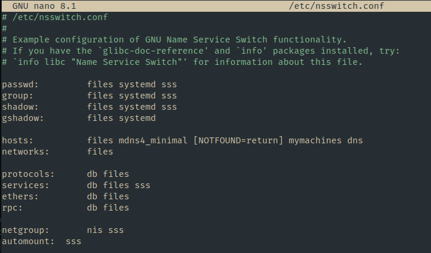

File `/etc/nsswitch.conf` pada sistem Linux mengatur metode pencarian informasi layanan nama, seperti pengguna, grup, dan host.

- **passwd, group, shadow**: Data diambil dari file lokal seperti `/etc/passwd`, `/etc/group`, dan `/etc/shadow` jika opsi `files` digunakan.
- **hosts**: Menentukan resolusi nama host ke IP. Memeriksa `/etc/hosts` terlebih dahulu (jika `files`) sebelum beralih ke DNS (jika `dns`).
- **Layanan lain**: `networks`, `protocols`, `services`, dll., dikonfigurasi untuk keperluan jaringan.

### File `/etc/hosts`

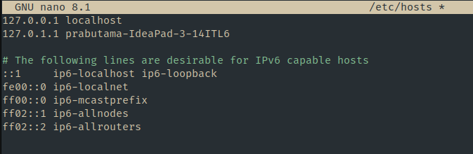

File ini memetakan nama host ke alamat IP secara lokal, memungkinkan sistem menemukan IP tanpa DNS eksternal.

- **Contoh konfigurasi**: `192.168.1.100 ale` menghubungkan nama `ale` ke IP tersebut.
- **Langkah konfigurasi**:
  1. Edit file dengan editor seperti `nano` (dengan hak root).
  2. Tambahkan entri.
  3. Uji dengan perintah `ping ale`.
- **Prioritas**: Sistem memeriksa `/etc/hosts` sebelum DNS.

### File `/etc/resolv.conf`

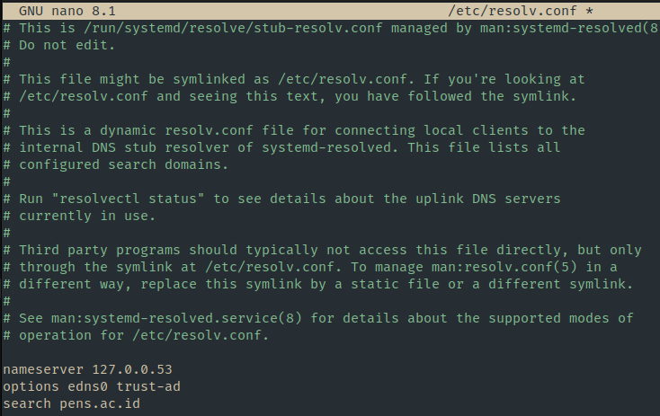

File ini mengatur resolusi DNS.

- **nameserver**: Menentukan IP server DNS (misalnya, `202.9.85.4`), dicoba berurutan jika ada lebih dari satu.
- **search**: Menambahkan domain otomatis (misalnya, `pens.ac.id`) ke nama host yang tidak lengkap, sehingga `ping www` menjadi `ping www.pens.ac.id`.
- **Cek isi**: Gunakan `sudo less /etc/resolv.conf`.

### Root Hints - `/usr/share/dns/root.hints`

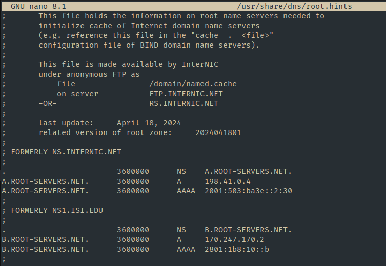

File ini berisi daftar server DNS root, digunakan oleh server DNS lokal (seperti BIND atau Unbound) untuk memulai pencarian domain secara rekursif jika informasi tidak ada di cache atau zona lokal.

### Kesimpulan

Sistem Linux menggunakan kombinasi file lokal (`/etc/hosts`, `/etc/nsswitch.conf`) dan konfigurasi DNS (`/etc/resolv.conf`, `root.hints`) untuk menerjemahkan nama host ke alamat IP. Prioritas diberikan pada resolusi lokal sebelum eksternal, dengan fleksibilitas melalui pengaturan server DNS dan domain pencarian.

Dalam komunikasi jaringan komputer terdapat sebuah sistem untuk melakukan pengenalan antar komputer. Sistem pengelolaan jaringan diibaratakan sebagai buku telepon internet. Dalam melakukan komunikasi data, setiap perangkat yang terhubung ke internet memiliki alamat IP yang unik agar sebuah mesin lain dapat menemukan perangkat tersebut. Untuk memudahkan pengenalan terdapat sebuah sistem yang mengatur yaitu Domain Name System (DNS). DNS berjalan melalui protokol UDP dengan port 53.

### Hirarki dalam DNS

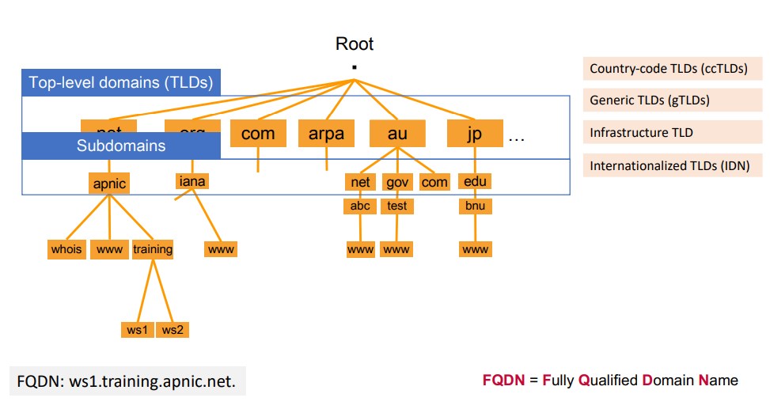

DNS tersusun dalam bentuk hirarki seperti pada gambar berikut. Urutan paling atas atau bisa disebut dengan root, dalam DNS disebut Top Level Domains (TLDs). TLDs terbagi menjadi 4 bagian yaitu Country-code (ccTLDs), Generic TLDs (GTLDs), Infrastructure TLD, dan Internationalized TLDs (IDN). Contoh TLDs adalah .com, .arpa, .id, .jp, dll. Dibawah TLDs terdapat Subdomains yang dapat mempunyai subdomain lain.

### Cara Kerja DNS

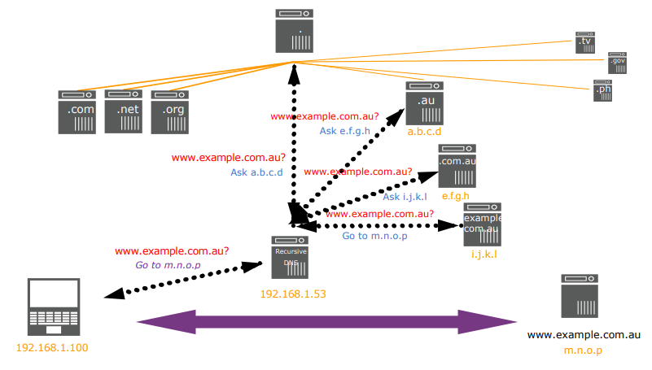

Cara kerja DNS adalah melakukan translasi nama domain untuk IP Address. Pada gambar tersebut terdapat sebuah contoh cara kerja DNS. Dari gambar berikut dapat dirincikan sebagai berikut.

1. Komputer client mencari www.example.com.au kepada 192.168.1.53.
2. Karena 192.168.1.53 tidak mengetahui domain tersebut sehingga dialihkan ke root.
3. Root memberitahukan kepada 192.168.1.53 untuk bertanya ke a.b.c.d.
4. Selanjutnya 192.168.1.53 akan mencari domain kepada a.b.c.d.
5. Karena a.b.c.d hanya mengetahui (.au), maka mengarahkan 192.168.1.53 untuk mencari domain ke e.f.g.h.
6. Selanjutnya 192.168.1.53 akan mencari domain kepada e.f.g.h.
7. Karena e.f.g.h hanya mengetahui (.com.au), maka mengarahkan 192.168.1.53 untuk mencari domain ke i.j.k.l.
8. Selanjutnya 192.168.1.53 akan mencari domain kepada i.j.k.l.
9. Karena i.j.k.l mengetahui (.example.com.au), maka memberikan konfirmasi ke 192.168.1.53 bahwa domain tersebut ditemukan.
10. Selanjutnya 192.168.1.53 juga memberi konfirmasi kepada 192.168.1.100 (client)
11. Setelah beberapa step tersebut maka, client sudah menemukan domain yang dicari, yaitu www.example.com.au pada m.n.o.p

### Komponen DNS

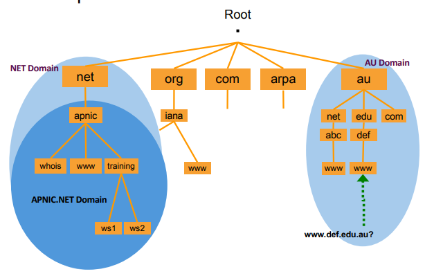

#### Namespace

Namespaces dalam konteks DNS merujuk pada struktur hierarkis dan logis yang digunakan untuk mengorganisasi nama domain. Ini adalah cara DNS membagi dan mengelompokkan domain ke dalam tingkatan yang terstruktur, sehingga tidak ada duplikat nama dan sistem tetap teratur. Namespace DNS bersifat pohon terbalik (inverted tree), dengan elemen-elemen berikut

- Root Domain: Titik paling atas dalam hierarki, dilambangkan dengan tanda titik (.). Meskipun tidak terlihat dalam penggunaan sehari-hari, ini adalah dasar dari semua domain (misalnya, www.example.com secara teknis adalah www.example.com.).
- Top-Level Domain (TLD): Tingkat di bawah root, seperti .com, .org, .edu, .id, atau TLD kode negara (ccTLD). TLD dikelola oleh organisasi seperti IANA (Internet Assigned Numbers Authority).
- Second-Level Domain: Bagian yang Anda daftarkan, seperti "example" dalam example.com. Ini adalah nama unik yang Anda pilih saat membeli domain.
- Subdomain: Bagian opsional yang bisa Anda tambahkan di sebelah kiri (misalnya, www atau blog dalam blog.example.com). Subdomain dapat dikonfigurasi untuk mengarahkan ke alamat IP yang berbeda.

Namespace ini memungkinkan sistem DNS bersifat terdistribusi dan skalabel. Misalnya, domain seperti mail.google.com menunjukkan "mail" sebagai subdomain, "google" sebagai second-level domain, dan ".com" sebagai TLD, semuanya diatur dalam namespace global yang unik.

#### Nameserver

Nameserver adalah server khusus yang bertugas menyimpan dan mengelola informasi DNS. Mereka bertanggung jawab untuk menjawab permintaan (query) dari pengguna atau sistem lain terkait pemetaan nama domain ke alamat IP. Ada beberapa jenis nameserver dalam hierarki DNS

- Root Nameserver: Titik awal dalam sistem DNS, yang mengarahkan permintaan ke TLD (Top-Level Domain) nameserver seperti .com, .org, atau .id. Ada 13 root nameserver utama di seluruh dunia (diberi label A sampai M), dioperasikan oleh berbagai organisasi.
- TLD Nameserver: Mengelola informasi untuk domain tingkat atas tertentu (misalnya, .com dikelola oleh Verisign). Mereka tahu di mana menemukan nameserver otoritatif untuk domain spesifik.
- Authoritative Nameserver: Server yang menyimpan data DNS aktual untuk domain tertentu (misalnya, example.com). Ini adalah tempat di mana informasi seperti alamat IP untuk domain tersebut disimpan.
- Recursive Resolver: Biasanya disCommons seperti server DNS publik (misalnya, Google DNS: 8.8.8.8) yang bekerja untuk pengguna akhir, mencari informasi dari nameserver lain atas nama klien hingga menemukan jawaban.

Ketika kita mengetikkan nama domain di browser, prosesnya melibatkan beberapa nameserver: resolver mengirimkan permintaan ke root, lalu TLD, dan akhirnya ke authoritative nameserver, sebelum mengembalikan alamat IP yang diminta.

#### Resolvers

Resolvers dalam DNS adalah komponen yang bertugas menyelesaikan (resolve) nama domain menjadi alamat IP dengan mengirimkan permintaan ke nameserver yang sesuai. Resolver biasanya berupa perangkat lunak di sisi klien (misalnya, pada komputer pengguna atau server) yang menginisiasi proses pencarian DNS.
Di Linux, resolver biasanya diatur oleh glibc (GNU C Library) melalui file konfigurasi /etc/resolv.conf. File ini memberi tahu sistem ke server DNS mana permintaan akan dikirim. Stub resolver di Linux akan menggunakan informasi ini untuk berkomunikasi dengan recursive resolver (misalnya, server DNS publik seperti 8.8.8.8 milik Google atau server lokal).

### Konfigurasi DNS - Kelompok 1

DNS Server: 10.252.108.109

1. Instalasi paket bind9
   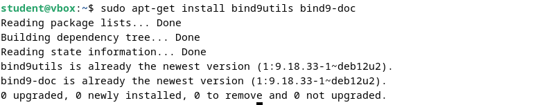

2. Konfigurasi bind9
   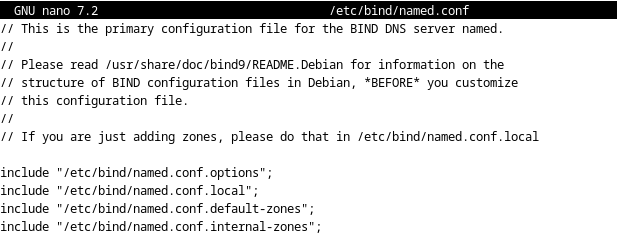

3. Menambahkan IP Internal
   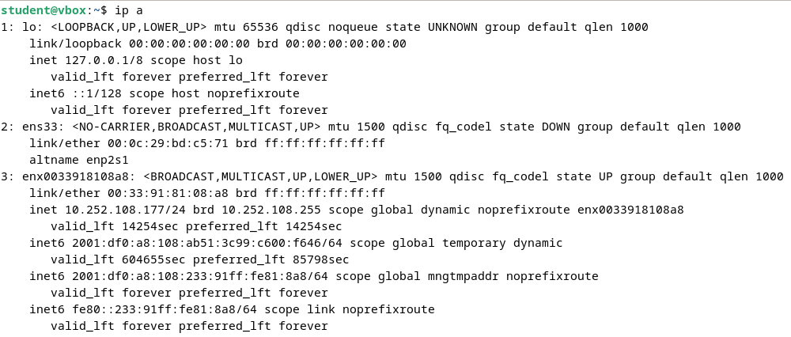
   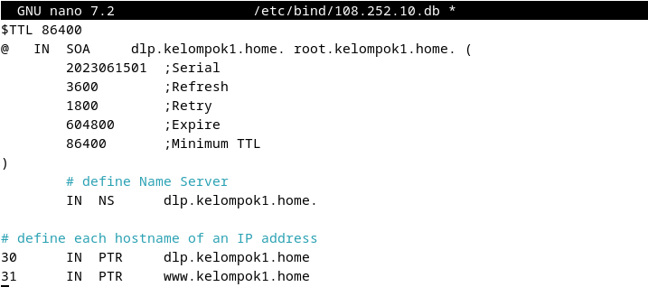

4. Konfigurasi Internal Zones
   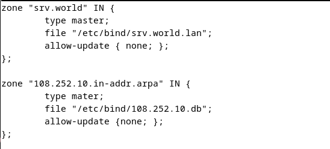

5. Konfigurasi Default Named
   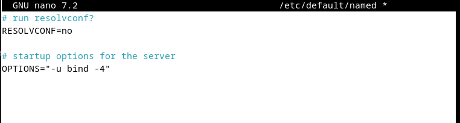

6. Menambahkan konfigurasi domain kelompok
   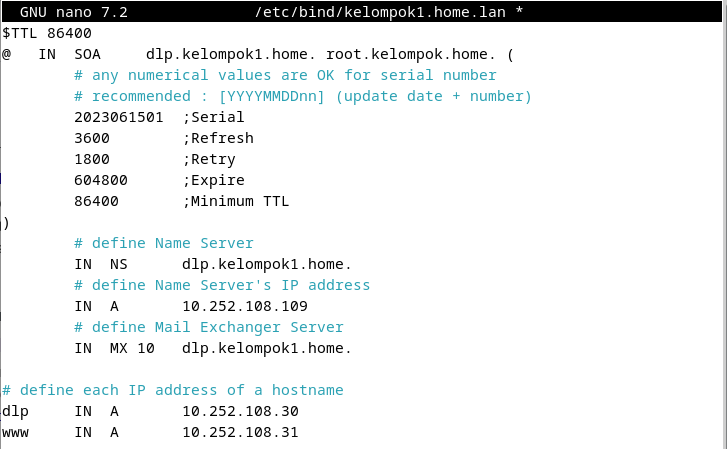

7. Membuat zone file untuk resolv server
   

8. Restart Named Service
   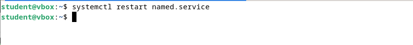

9. Cek Menggunakan IP Address
   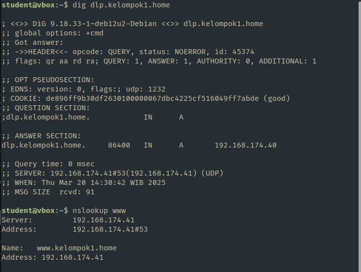
