

  <h2 style="text-align: center;font-weight: bold">LAPORAN PRAKTIKUM   WORKSHOP ADMINISTRASI JARINGAN </h2>
  <h4 style="text-align: center;">Dosen Pengampu : Dr. Ferry Astika Saputra, S.T., M.Sc.</h4>

 

  
  <h3 style="text-align: center;">Disusun Oleh : </h3>
  

    <strong>Danur Isa Prabutama (3123500023)</strong> 
  

<h3 style="text-align: center;line-height: 1.5; text-transform: uppercase">Politeknik Elektronika Negeri Surabaya Departemen Teknik Informatika Dan Komputer Program Studi Teknik Informatika 2025/2026</h3>
  

<h3 style="text-align: center;line-height: 1.5">Praktikum Minggu 6</h3>

#### Persiapan Kebutuhan Praktikum

Pada praktikum ini mahasiswa diberikan tugas menyiapkan VM untuk kebutuhan praktikum mata kuliah Administrasi Jaringan pada masing-masing laptop. Praktikum Adminisitrasi Jaringan membutuhkan 2 Virtual Machine yang terdiri dari Client dan Server.

#### Konfigurasi pada VM 1 (Server)

Seperti yang telah disebutkan, salah satu VM akan menjadi server dan kita sebut saja VM 1 adalah VM yang akan menjadi server. VM 1 memiliki 2 network adapter yang terdiri dari Bridge Adapter (Terhubung ke Internet) dan Internal Network (Terhubung ke Client). Server memungkinkan memberikan ke jaringan internet dengan menjadi gateway untuk client. Selain itu, VM 1 juga dikonfigurasi Samba untuk kebutuhan file transfer, NTPSec untuk sinkronisasi waktu, dan Bind9 untuk local domain. Berikut detail langkah-langkahnya.

###### 1. Kongigurasi Network Adapter

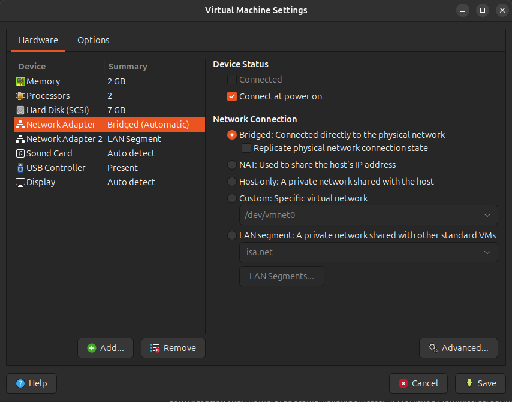

Server memiliki 2 network adapter yang terdiri dari Bridged Adapter dan Internal Network (LAN Segment jika di VM Ware). Adapter bridged digunakan untuk terhubung ke internet dan Internal Network terhubung ke VM 2 (client).

###### 2. Konfigurasi IP Address pada Adapter 2 (Internal Network)

Selanjutnya berikan konfigurasi pada IP Addresss pada adapater 2, yaitu network yang akan dibagikan oleh client.

###### Tambahkan pada file /etc/network/interfaces

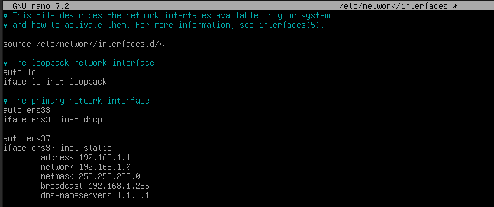

Network Adapter yang telah dikonfigurasi akan diberikan nama yang unik oleh sistem. Untuk adapter pada VM saya terdapat ens33 (Bridged) dan ens37 (Internal Network). ens33 dikonfigurasi dhcp agar mendapatkan IP Address dari internet. ens37 diberikan konfigurasi seperti pada gambar yang akan digunakan sebagai gateway.

###### 3. Aktifkan forwarding di Server

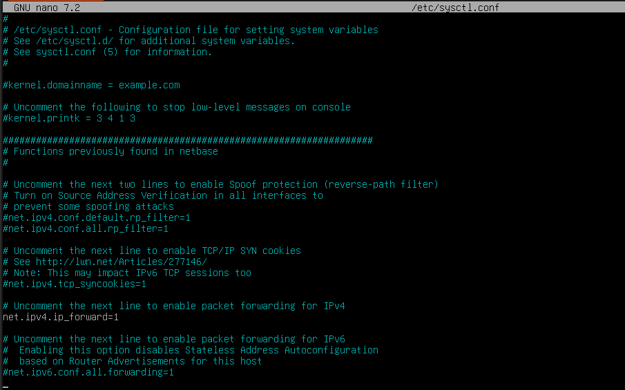

Aktifkan fitur penerusan IP di sistem Linux. Dengan mengaktifkan penerusan IP, sistem dapat bertindak sebagai router atau gateway, mengarahkan lalu lintas jaringan antara jaringan yang berbeda. Hapus komentar pada baris `net.ipv4.ip_forward`

###### Lakukan Validasi

Validasi dengan menjalankan perintah `sysctl -p`

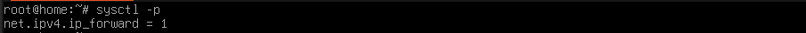

###### 4. Konfigurasi Iptables

Iptables adalah alat untuk mengelola firewall pada sistem operasi Linux. Iptables berfungsi sebagai filter lalu lintas data yang masuk dan keluar dari sistem. Iptables juga dikenal sebagai "firewall ruleset".

###### a. Instal Paket `iptables` & `iptables-persistent`

      apt install iptables iptables-persistent

###### b. Konfigurasi aturan iptables

1. Berikan modifikasi pada file `/etc/iptables/rules.v4`

   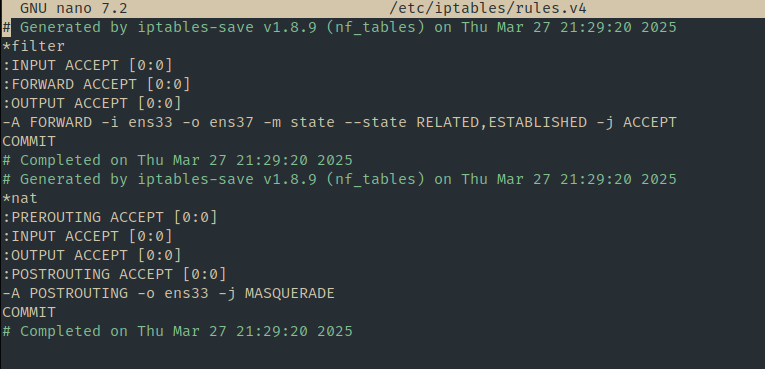

   Dengan konfigurasi aturan ini, maka VM 1 akan bertindak sebagai router dengan NAT (menghubungkan dua interface: ens33 dan ens37). Trafik dari LAN yang keluar ke ens33 akan dimasquerade (NAT), sehingga ens37 akan terhubung ke internet tetapi tidak menggunakan IP Publlik melainkan diwakilkan oleh ens33.\

2. Jalankan perintah `sudo iptables-save > /etc/iptables/rules.v4` untuk menyimpan konfigurasi iptables

###### 5. Reboot

Setelah semua langkah konfigurasi sudah dilakukan. maka reboot vm dengan menjalankan perintah `sudo reboot`

#### Konfigurasi NTP (NTPSec) Pada VM 1 (Server)

1. Instalai paket `ntpsec`

   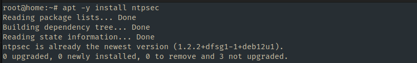

2. Konfigurasi server NTP

   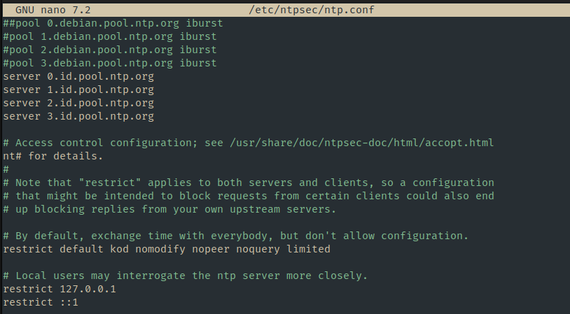

   Berikan modifikasi server dengan mengganti server NTP

3. Restart service ntpsec
   Jalankan perintah `systemctl restart ntpsec`

4. Validasi NTP Server
   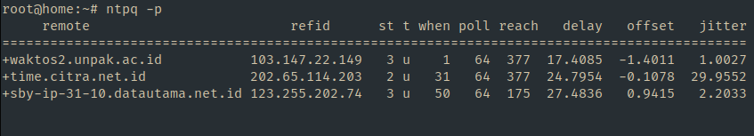

#### Konfigurasi File Server (Samba) Pada VM 1 (Server)

1. Instalasi paket samba
   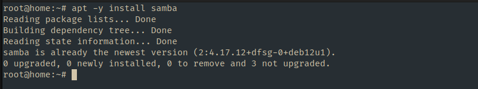

2. Buat direktori untuk dibagikan `mkdir /home/share`
3. Ubah permission agar bisa diakses `chmod 777 /home/share`
4. Konfigutasi samba di file `/etc/samba/smb.conf`
   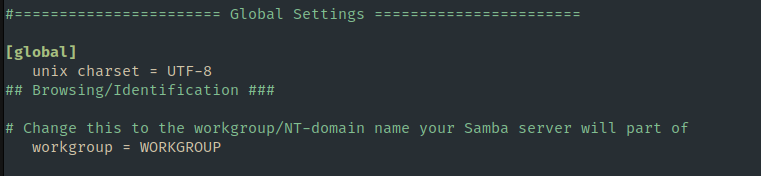
   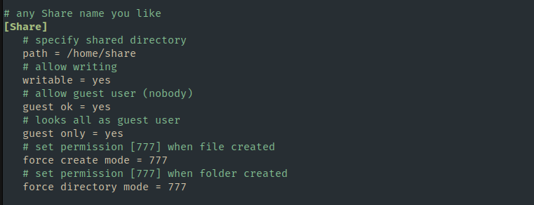
5. Restart service smbd `systemctl restart smbd`

#### Konfigurasi DNS Server (Bind9) Pada VM 1 (Server)

1. Instalasi paket dengan menjalankan perintah `apt -y install bind9 bind9utils`
2. Modifikasi file `/etc/bind/named.conf`

   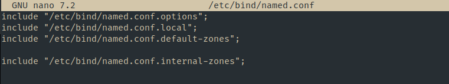

3. Modifikasi file `vi /etc/bind/named.conf.options`

   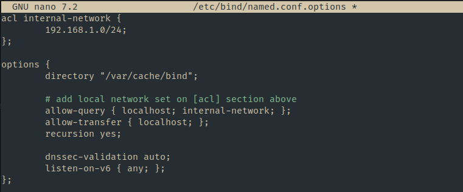

4. Konfigurasi internal zone pada file `/etc/bind/named.conf.internal-zones`

   

5. Konfigurasi file `/etc/default/named`

   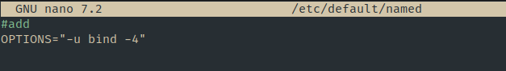

6. Buat file sesuai dengan domain lokal

   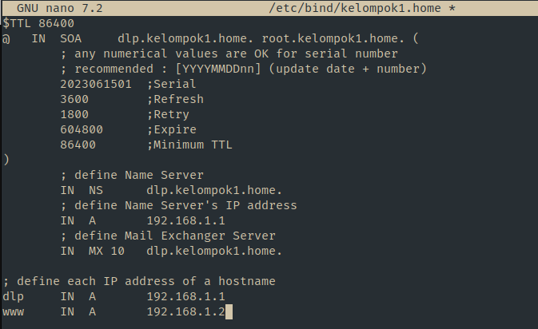

7. Buat file sesuai dengan IP Address

   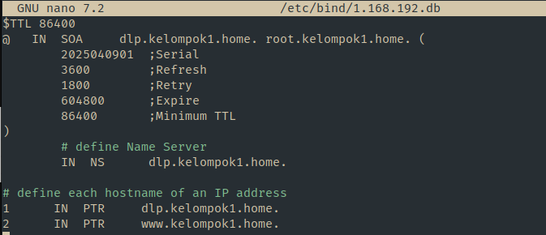

#### Konfigurasi pada VM 2 (Client)

Pada VM 2 akan diberikan konfigurasi IP Address yang berada dalam satu dengan VM 1 (ens33) sehingga VM 1 dan VM 2 dapat berkomunikasi.

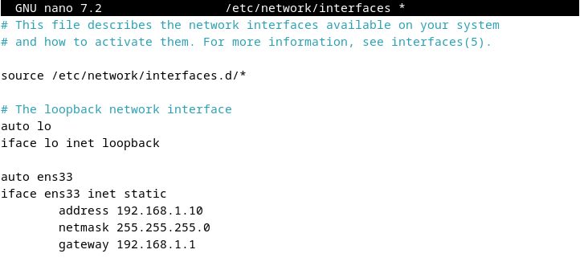

Cek koneksi dengan `ping`ke gateway

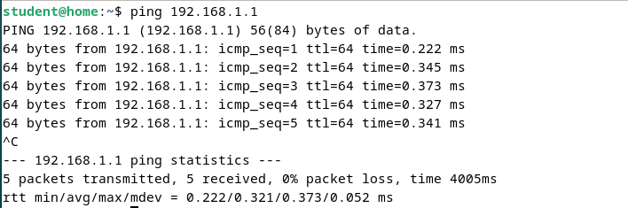

#### Tes akses file dari Samba (Client)

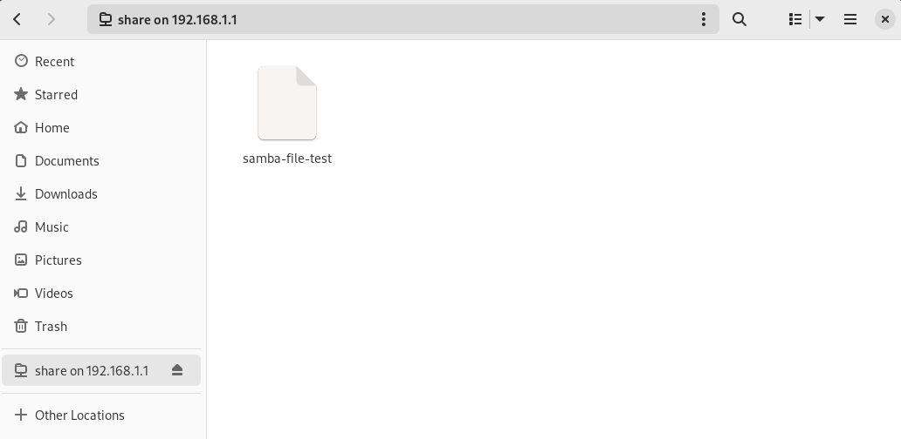

#### Tes DNS Server (Client)

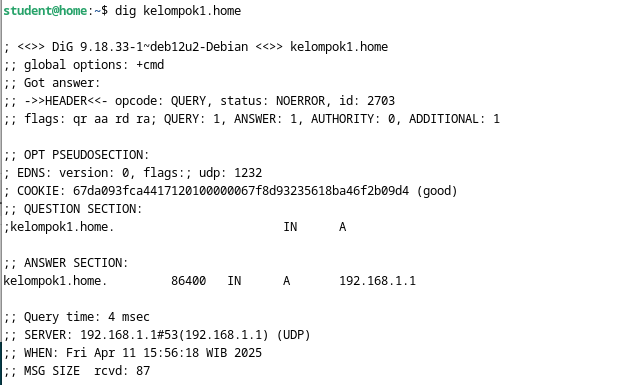
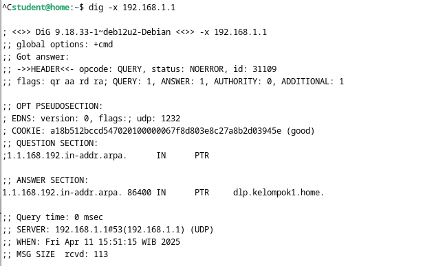
