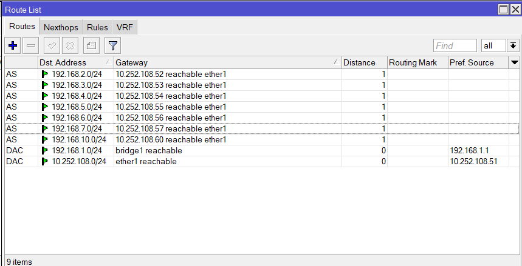

  <h2 style="text-align: center;font-weight: bold">LAPORAN PRAKTIKUM   WORKSHOP ADMINISTRASI JARINGAN </h2>
  <h4 style="text-align: center;">Dosen Pengampu : Dr. Ferry Astika Saputra, S.T., M.Sc.</h4>

 

  
  <h3 style="text-align: center;">Disusun Oleh : </h3>
  

    <strong>Danur Isa Prabutama (3123500023)</strong> 
  

<h3 style="text-align: center;line-height: 1.5; text-transform: uppercase">Politeknik Elektronika Negeri Surabaya Departemen Teknik Informatika Dan Komputer Program Studi Teknik Informatika 2025/2026</h3>
  

<h3 style="text-align: center;line-height: 1.5">Praktikum Minggu 7</h3>

#### Konfigurasi Mikrotik Menggunakan Winbox

Mikrotik adalah perangkat lunak (RouterOS) dan perangkat keras (RouterBoard) yang digunakan untuk mengelola jaringan komputer dan internet. RouterOS memungkinkan komputer berfungsi sebagai router, firewall, dan perangkat jaringan lainnya. RouterBoard, yang juga merupakan produk Mikrotik, adalah perangkat keras yang dirancang khusus untuk menjalankan RouterOS.

Winbox adalah software untuk mengkonfigurasi MikroTik menggunakan alamat MAC atau protokol IP. Winbox memungkinkan konfigurasi MikroTik RouterOS dan RouterBoard dengan cepat dan mudah dalam mode GUI. Winbox dibangun dengan binary Win32, tetapi berjalan di Linux dan Mac OS X menggunakan Wine. Semua fungsionalitas Winbox disusun dan dirancang semirip mungkin dengan fungsionalitas console, sehingga terminologi yang sama digunakan untuk fungsionalitas console.

##### Koneksi Routherboard Sesuai Kelompok

Pada praktikum kali ini, disesdiakan mikrotik routerboard yang telah dikonfigurasi dengan IP sesuai kelompok. Rincian dari konfigurasinya adalah sebagai berikut. Interface Ether 1 dikonfigurasi dengan IP Address 10.252.108.51 dan Bridge dikonfigurasi dengan IP Address 192.168.1.1. Ether 1 akan digunakan untuk komunikasi dengan router kelompok lain dengan jalur yang langsung terhubung. Interface Bridge digunakan untuk koneksi jaringan lokal dalam kelompok.

##### Konfigurasi Routing

Tugas praktikum ini adalah menghubungkan jarigan internal kelompok (Interface Bridge) agar dapat berkomunikasi dengan jaringan internal kelompok lain. Untuk langkah konfigurasinya adalah sebagai berikut.

###### 1. Masuk ke menu konfigurasi dengan menggunakan winbox

Winbox adalah aplikasi berbasis GUI dari MikroTik yang digunakan untuk mengkonfigurasi perangkat RouterOS. Langkah pertama adalah membuka aplikasi Winbox, lalu login ke router menggunakan MAC Address atau IP Address, dan masukkan username serta password (biasanya default: admin, password kosong jika belum diatur).

###### 2. Cek Interface, Pastikan Ether 1 dan Bridge sudah dikonfigurasi

Masuk ke menu Interfaces, kemudian periksa apakah interface ether1 sudah aktif (biasanya untuk koneksi ke router lain atau jaringan luar) dan interface bridge sudah dibuat serta berisi port yang sesuai (misalnya ether2, ether3, dsb yang digunakan untuk jaringan internal kelompok).
Tujuan pengecekan ini adalah memastikan perangkat telah memiliki jalur koneksi baik ke luar maupun ke jaringan internal lokal.

###### 3. Tambahkan roting dengan network tujuan masing-masing kelompok

Langkah ini dilakukan agar router tahu ke mana harus mengirimkan paket untuk jaringan kelompok lain.

###### 4. Periksa konfigurasi routing, nonaktifkan jalur yang tidak terpakai agar menghindari konflik

Setelah menambahkan route, tetap di menu IP > Routes, periksa semua daftar routing yang ada.
Jika ada route yang statusnya tidak aktif (X), tidak valid, atau tidak digunakan, bisa dinonaktifkan (klik kanan > Disable) atau dihapus agar tidak menyebabkan konflik routing.
Hal ini penting untuk menjaga stabilitas jaringan dan mencegah terjadinya pengiriman paket yang salah arah.

###### 5. Lakukan percobaan PING ke Gateway atau Host jaringan internal kelompok yang telah ditambahkan

Jika hasilnya reply from..., berarti konfigurasi routing berhasil dan router bisa berkomunikasi dengan jaringan internal kelompok lain.

\*Note: Mohon maaf ada beberapa step yang saya lupa screenshot
