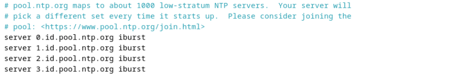
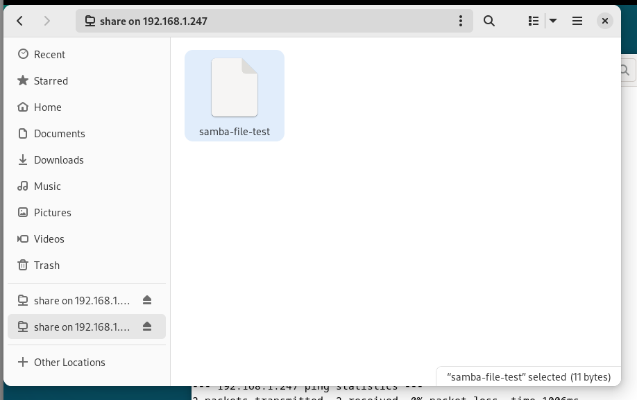
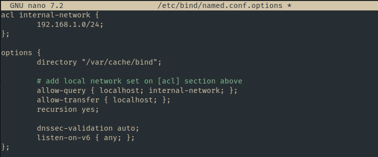
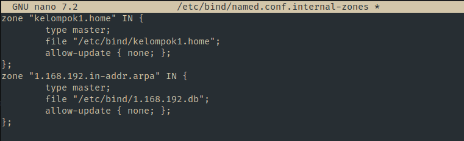
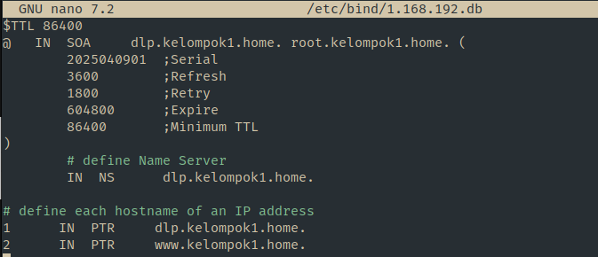
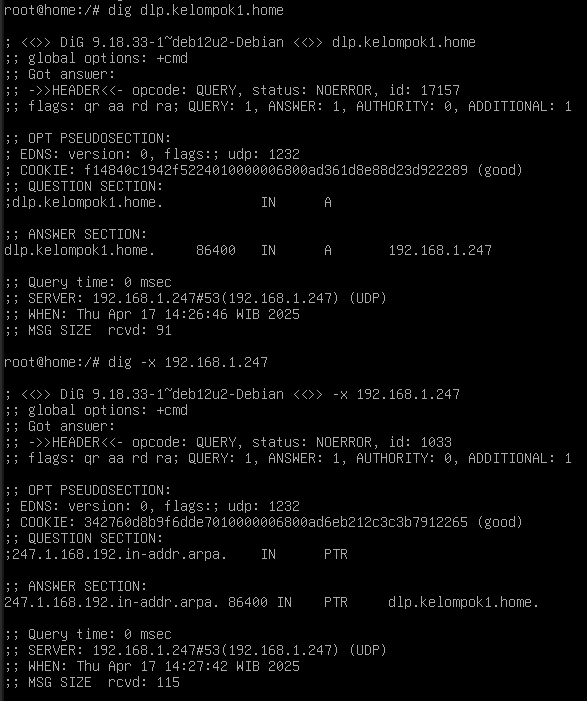

  <h2 style="text-align: center;font-weight: bold">LAPORAN PRAKTIKUM   WORKSHOP ADMINISTRASI JARINGAN </h2>
  <h4 style="text-align: center;">Dosen Pengampu : Dr. Ferry Astika Saputra, S.T., M.Sc.</h4>

 

  
  <h3 style="text-align: center;">Disusun Oleh : </h3>
  

    <strong>Danur Isa Prabutama (3123500023)</strong> 
  

<h3 style="text-align: center;line-height: 1.5; text-transform: uppercase">Politeknik Elektronika Negeri Surabaya Departemen Teknik Informatika Dan Komputer Program Studi Teknik Informatika 2025/2026</h3>
  

<h3 style="text-align: center;line-height: 1.5">Praktikum Minggu 8</h3>

#### Migrasi NTP, DNS, SAMBA ke Jaringan Lab (Kelompok 1)

Praktikum ini bertujuan untuk memindahkan konfigurasi NTP (Network Time Protocol), DNS (Domain Name System), dan SAMBA (file sharing server) dari jaringan internal network ke jaringan lab sesuai dengan kelompk masing-masing. Berikut langkah-langkah konfigurasinya.

#### Konfigurasi NTP (NTPSec) Pada VM 1 (Server)

1. Instalai paket `ntpsec`

   

2. Konfigurasi server NTP

   

   Berikan modifikasi server dengan mengganti server NTP

3. Restart service ntpsec
   Jalankan perintah `systemctl restart ntpsec`

4. Validasi NTP Server
   

#### Instalasi dan Konfigurasi Samba

Samba adalah perangkat lunak open-source yang memungkinkan berbagi file dan printer antara sistem operasi Windows dan Unix-like (seperti Linux, macOS, dan lainnya). Samba mengimplementasikan protokol SMB/CIFS (Server Message Block/Common Internet File System), yang merupakan protokol berbagi file dan printer yang digunakan secara luas di jaringan Windows. Berikut langkah konfigurasinya.

#### Instalasi package Samba

 

#### Percobaan Akes FIle Samba

1. Konfigurasi pada samba

2. Membuat sebuah file di direktori /home/share

3. Percobaan akses dari jaringan kelompok

4. Percobaan akses dari host jaringan kelompok lain

### Konfigurasi Bind9

DNS Server: 192.168.1.247

#### Konfigurasi DNS Server (Bind9) Pada Server

1. Instalasi paket dengan menjalankan perintah `apt -y install bind9 bind9utils`
2. Modifikasi file `/etc/bind/named.conf`

   

3. Modifikasi file `vi /etc/bind/named.conf.options`

   

4. Konfigurasi internal zone pada file `/etc/bind/named.conf.internal-zones`

   

5. Konfigurasi file `/etc/default/named`

   

6. Buat file sesuai dengan domain lokal

   

7. Buat file sesuai dengan IP Address

   

#### Tes DNS Server 1

1. Tes DNS Server dari jaringan dalam kelompok

